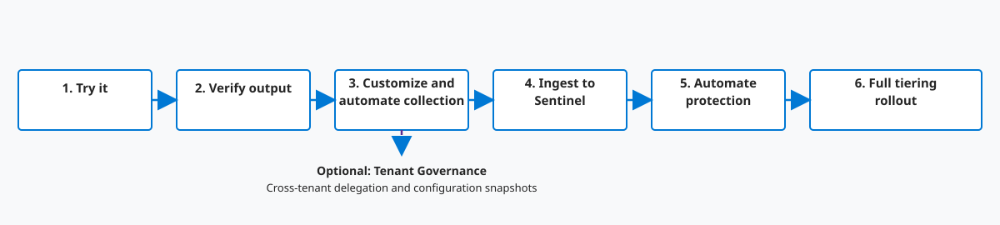

# Get Started with EntraOps

This guide follows the [adoption roadmap](#adoption-roadmap) from a single cmdlet to full tiering:
prerequisites, choosing how you want to run EntraOps, signing in, and deploying the automation -
either interactively/locally or fully automated with GitHub Actions - through to Sentinel
ingestion, automated protection, and full rollout.

> [!TIP]
> **Quick start:** sign in interactively and try EntraOps right now - no configuration file needed:
> ```powershell
> Import-Module ./EntraOps
> Connect-EntraOps -AuthenticationType "UserInteractive" -TenantName "contoso.onmicrosoft.com"
> Invoke-EntraOpsPrivilegedEAM
> ```
> See [1. Try it with zero configuration](#try-it-with-zero-configuration) below for details, or keep reading for prerequisites and the full adoption roadmap.

## Prerequisites

- **PowerShell 7.4 (Core)** or later on any platform (Windows, Linux, macOS), or GitHub Codespaces / GitHub Actions runners. The module enforces this minimum version during import.
- A Microsoft Entra ID tenant where you have (temporarily) **Global Administrator** and **User Access Administrator** permissions to register the application used by EntraOps and grant it the required Microsoft Graph and Azure RBAC permissions.
- Optional: a GitHub account/organization if you want to run EntraOps as a scheduled, automated pipeline instead of (or in addition to) interactive/local execution.
- Optional: a Log Analytics workspace or Microsoft Sentinel workspace if you want to ingest classification data into custom tables or WatchLists (see [Reportings &rarr; Microsoft Sentinel integration](../reportings/index.html#microsoft-sentinel-integration)).

## Adoption roadmap: from a single cmdlet to full tiering {#adoption-roadmap}

Most teams grow into EntraOps along the same path: start with a one-off, zero-configuration
export, then progressively turn on customization, automation, ingestion, and enforcement as
confidence and coverage increase. Each phase below links to the section of this guide (or the
feature area) that covers it - the rest of this guide walks through them in order.

**1. Try it &rarr; 2. Verify output &rarr; 3. Customize &amp; automate collection &rarr; 4. Ingest to Sentinel &rarr; 5. Automate protection &rarr; 6. Full tiering rollout** (optional branch: Tenant Governance)



| Phase                              | Goal                                                                          | What you enable                                                                                                                                                                                                               | Learn more                                                              |
| ---------------------------------- | ----------------------------------------------------------------------------- | ----------------------------------------------------------------------------------------------------------------------------------------------------------------------------------------------------------------------------- | ----------------------------------------------------------------------- |
| 1. Try it                          | See your Enterprise Access Model classification with no setup                 | Sign in interactively with `Connect-EntraOps`, then run `Invoke-EntraOpsPrivilegedEAM`                                                                                                                                        | [1. Try it with zero configuration](#try-it-with-zero-configuration)    |
| 2. Verify output                   | Confirm classification and scope match expectations before automating         | Review the export with Classification Explorer or EAM Dashboard - no Sentinel or Azure subscription required                                                                                                                  | [2. Verify output with reports and workbooks](#phase-2-verify-output)   |
| 3. Customize & automate collection | Tailor tiering to your tenant and make collection repeatable, tracked-as-code | Create `EntraOpsConfig.json`, add [role/action overwrites](../privileged-eam/index.html#customize-classification-by-overwrites), deploy a workload identity with federated credentials and scheduled GitHub Actions pipelines | [3. Customize and automate collection with GitHub](#deploy-with-github) |
| 4. Ingest to Sentinel              | Centralize privileged access data for detection and hunting                   | Enable `IngestToLogAnalytics` / `IngestToWatchLists`                                                                                                                                                                          | [4. Ingest to Sentinel](#phase-4-ingest-to-sentinel)                    |
| 5. Automate protection             | Enforce tiering, not just report on it                                        | Enable Conditional Access target groups, Administrative Unit management, RMAU assignment for unprotected objects, and Entitlement Management catalog protection                                                               | [5. Automate protection](#phase-5-automate-protection)                  |
| 6. Full tiering rollout            | Validate the tiered implementation once more and connect it to your SOC       | Review reporting apps/workbooks again with live data, then build Sentinel detections on the Custom Table/WatchLists                                                                                                           | [6. Full tiering rollout](#phase-6-full-tiering-rollout)                |
| Optional: Tenant Governance        | Extend tiering across tenant boundaries and track configuration drift         | Enable cross-tenant delegated administration classification and/or Microsoft Graph UTCM configuration snapshots                                                                                                               | [Tenant Governance](#optional-tenant-governance)                        |

> [!TIP]
> You don't have to complete a phase fully before starting the next one - for example, many teams
> enable Sentinel ingestion (phase 4) before automating AU/group protection (phase 5). Treat this as
> a roadmap of capabilities to grow into, not a strict sequence.

## Choose your integration

EntraOps can be executed the same way in every scenario - only how you sign in and how often it runs differs:

| Scenario                                       | Sign-in                                                                                 | Best for                                                                |
| ---------------------------------------------- | --------------------------------------------------------------------------------------- | ----------------------------------------------------------------------- |
| Interactive / local execution                  | `UserInteractive`, `DeviceAuthentication`                                               | Exploration, ad-hoc queries, one-off exports                            |
| Automated pipeline (GitHub Actions)            | Federated credentials via `Connect-EntraOps -AuthenticationType "FederatedCredentials"` | Scheduled collection, tracked history "as code", automated reporting    |
| Automation / worker with existing Az session   | `AlreadyAuthenticated`                                                                  | Custom automation, Azure Automation, other CI/CD systems                |
| Azure resource with a system-assigned identity | `SystemAssignedMSI`                                                                     | Azure Automation, Functions, VMs and other identity-enabled Azure hosts |
| User-assigned managed identity                 | `UserAssignedMSI`                                                                       | Execution from an Azure resource with an assigned managed identity      |

If you are unsure, start with interactive/local execution to explore your data, then follow
[3. Customize and automate collection with GitHub](#deploy-with-github) once you know which RBAC
systems and settings you want to automate.

## 1. Try it with zero configuration {#try-it-with-zero-configuration}

You can run a full Privileged EAM classification without creating an `EntraOpsConfig.json` file or a
`Classification` folder first. EntraOps signs in to Azure and Microsoft Graph interactively, so the
Microsoft Graph sign-in can request the delegated permissions required for collection:

> [!NOTE]
> You may be asked to grant consent if the Microsoft Graph PowerShell client does not already have
> the delegated scopes required for this run. Review the [baseline collection permissions](../core/index.html#service-principal-permissions).

For complete interactive collection, use an account with **Global Reader** activated in Microsoft
Entra ID and **Reader** on the root scope, which covers every management group,
subscription and resource below it. Event directly assignments on the root scope through `elevateAccess` are also considered. An administrator who can create role assignments at that scope
can grant the Azure role with
[`New-AzRoleAssignment`](https://learn.microsoft.com/en-us/powershell/module/az.resources/new-azroleassignment):


```powershell
New-AzRoleAssignment -ApplicationId "<workload-identity-client-id>" -RoleDefinitionName "Reader" -Scope "/"
```

`Invoke-EntraOpsPrivilegedEAM` resolves the tenant from the EntraOps connection, downloads the latest
classification templates, computes the Control Plane scope, runs
`Save-EntraOpsPrivilegedEAMJson`, and cleans up every intermediate file so only the PrivilegedEAM
JSON output remains (except for any pre-existing `Classification_RoleActionOverwrites.json` /
`Classification_RoleDefinitionOverwrites.json` tenant customization files, which are always
preserved). Use `-RbacSystems` to limit the scope, or `-PrivilegedObjectClassificationSource` to
change how Control Plane scope is determined - see
[Privileged EAM &rarr; Automatic Control Plane scope updates](../privileged-eam/index.html#automatic-updated-control-plane-scope).

> [!TIP]
> This is the fastest way to try EntraOps or produce a one-off export. Continue with [2. Verify output with reports and workbooks](#phase-2-verify-output) before you keep using it, or jump straight to [3. Customize and automate collection with GitHub](#deploy-with-github) for a repeatable, automated setup.

## 2. Verify output with reports and workbooks {#phase-2-verify-output}

Before automating collection, review the PrivilegedEAM export from
[1. Try it with zero configuration](#try-it-with-zero-configuration) (or a manual
`Save-EntraOpsPrivilegedEAMJson` run) to confirm the classification and Control Plane scope match
your expectations. Generate the
[reporting apps](../reportings/index.html#entraops-reporting-apps) against the local export -
Classification Explorer and EAM Dashboard are built entirely from it, no Log Analytics workspace or
Azure subscription required:

```powershell
New-EntraOpsReportingData
```

Azure Monitor workbooks are also available, but only once data has been ingested into Log
Analytics/Sentinel - see [4. Ingest to Sentinel](#phase-4-ingest-to-sentinel) below.

> [!TIP]
> Catching a misclassified role or an overly broad Control Plane scope now is much cheaper than
> after Conditional Access target groups, Administrative Units, or Sentinel ingestion have already
> been automated from it.

## Import module and sign-in options

Import the PowerShell module (by default, required modules are installed automatically):

```powershell
Import-Module ./EntraOps
```

### User Interactive with consented Microsoft Graph PowerShell

```powershell
Connect-EntraOps -AuthenticationType "UserInteractive" -TenantName "contoso.onmicrosoft.com"
```

### User Interactive in GitHub Codespaces (Device Authentication)

```powershell
Connect-EntraOps -AuthenticationType "DeviceAuthentication" -TenantName "contoso.onmicrosoft.com"
```

### User-Assigned Managed Identity

```powershell
Connect-EntraOps -AuthenticationType "UserAssignedMSI" -TenantName "contoso.onmicrosoft.com" -AccountId "00000000-0000-0000-0000-000000000000"
```

`AccountId` is the user-assigned managed identity **application (client) ID**, not its object ID.
The identity must already have the application permissions and Azure roles listed under
[Core &rarr; Service principal permissions](../core/index.html#service-principal-permissions).

### System-Assigned Managed Identity

```powershell
Connect-EntraOps -AuthenticationType "SystemAssignedMSI" -TenantName "contoso.onmicrosoft.com"
```

### Service Principal with client secret

```powershell
$ServicePrincipalCredentials = Get-Credential
Connect-AzAccount -Credential $ServicePrincipalCredentials -ServicePrincipal -Tenant $TenantName
Connect-EntraOps -TenantName $TenantName -AuthenticationType "AlreadyAuthenticated"
```

### Workload with already-authenticated Azure PowerShell

```powershell
Connect-EntraOps -AuthenticationType "AlreadyAuthenticated" -TenantName "contoso.onmicrosoft.com"
```

Continue with [Privileged EAM &rarr; Collecting and exporting data](../privileged-eam/index.html#collecting-and-exporting-data)
once you are signed in, or follow the steps below to deploy EntraOps as an automated GitHub pipeline.

## Configured local or custom automation run {#configured-local-run}

Use this path when you want repeatable settings locally or on a supported automation platform such
as Azure Automation Runbooks, without GitHub Actions. Use the guided setup above to download a
complete config directly, create it with `New-EntraOpsConfigFile`, or open the template in the
[Configuration Wizard](../configuration/index.html).
The browser wizard requires both the tenant domain and tenant ID because workload and managed
identities cannot resolve a placeholder ID during non-interactive startup.

```powershell
Import-Module ./EntraOps
Connect-EntraOps -AuthenticationType "UserInteractive" `
  -TenantName "contoso.onmicrosoft.com" `
  -TenantId "00000000-0000-0000-0000-000000000000" `
  -ConfigFilePath "./EntraOpsConfig.json"

Save-EntraOpsPrivilegedEAMJson -RbacSystems $EntraOpsConfig.RbacSystems
Disconnect-EntraOps
New-EntraOpsReportingData
```

For `UserAssignedMSI`, add `-AccountId <managed-identity-client-id>`. For
`AlreadyAuthenticated`, establish the Azure context before calling `Connect-EntraOps`. The account
or identity running configured local automation must have the same read or write permissions as a
GitHub workload identity; `New-EntraOpsWorkloadIdentity` only provisions those permissions for the
application it creates or updates.

Run enabled optional operations after collection. These are the same cmdlets used by the shipped
GitHub workflows:

| Config feature                            | Local/custom automation command                                                                                                                                                                        |
| ----------------------------------------- | ------------------------------------------------------------------------------------------------------------------------------------------------------------------------------------------------------ |
| Update classification templates           | `$Params = $EntraOpsConfig.AutomatedClassificationUpdate; Update-EntraOpsClassificationFiles @Params`                                                                                                  |
| Update Control Plane scope                | `$Params = $EntraOpsConfig.AutomatedControlPlaneScopeUpdate; Update-EntraOpsClassificationControlPlaneScope @Params`                                                                                   |
| Log Analytics ingestion                   | `$Params = $EntraOpsConfig.LogAnalytics; Save-EntraOpsPrivilegedEAMInsightsCustomTable @Params`                                                                                                        |
| Sentinel WatchLists                       | `$Params = $EntraOpsConfig.SentinelWatchLists; Save-EntraOpsPrivilegedEAMWatchLists @Params`                                                                                                           |
| Administrative Units                      | `$Params = $EntraOpsConfig.AutomatedAdministrativeUnitManagement; New-EntraOpsPrivilegedAdministrativeUnit @Params; Update-EntraOpsPrivilegedAdministrativeUnit @Params`                               |
| Unprotected-object RMAU                   | `$Params = $EntraOpsConfig.AutomatedRmauAssignmentsForUnprotectedObjects; New-EntraOpsPrivilegedUnprotectedAdministrativeUnit @Params; Update-EntraOpsPrivilegedUnprotectedAdministrativeUnit @Params` |
| Conditional Access target groups          | `$Params = $EntraOpsConfig.AutomatedConditionalAccessTargetGroups; New-EntraOpsPrivilegedConditionalAccessGroup @Params; Update-EntraOpsPrivilegedConditionalAccessGroup @Params`                      |
| Entitlement Management catalog protection | `$Params = $EntraOpsConfig.AutomatedElmCatalogProtection; Update-EntraOpsPrivilegedUnprotectedElmCatalog @Params`                                                                                      |

Only run write operations after reviewing the generated Privileged EAM export. Interactive sign-in
requests the delegated read scopes used for collection; write features and UTCM snapshots can need
additional consent or a pre-provisioned workload/managed identity. See the feature-specific
permission table before enabling them.

## 3. Customize and automate collection with GitHub {#deploy-with-github}

The following steps set up EntraOps as a scheduled, automated pipeline in your own GitHub
repository, using a Microsoft Entra workload identity with federated credentials (no secrets
stored in GitHub). Steps 3.4 and 3.6 customize your configuration; the rest set up the automated
pipeline itself, with 3.5 as optional prep for [4. Ingest to Sentinel](#phase-4-ingest-to-sentinel).

> [!TIP]
> Watch a [walkthrough of these steps](https://www.cloud-architekt.net/assets/images/entraops/setup_1-ghconfig.gif).

### 3.1 Create your repository from this template {#step-1-create-your-repository-from-this-template}

Use the [EntraOps GitHub template](https://github.com/Cloud-Architekt/EntraOps/generate) and choose a
**private** repository. This is enforced: the `Pull-EntraOpsPrivilegedEAM`,
`Pull-EntraOpsTenantGovernance` and `Update-EntraOps` workflows refuse to commit/push (and
`Push-EntraOpsPrivilegedReporting` skips publishing its artifact/release) if the repository is
public, since the pushed data may contain tenant details (object IDs, UPNs, role assignments,
policy configuration).

### 3.2 Clone your new EntraOps repository {#step-2}

Clone locally, or use a GitHub Codespace. A devcontainer is available to load the required dependencies.

```powershell
git clone "https://github.com/<GitHubUserOrOrg>/<PrivateRepoName>.git"
Set-Location "<PrivateRepoName>"
```

### 3.3 Import the EntraOps PowerShell module {#step-3}

```powershell
Import-Module ./EntraOps
```

### 3.4 Create a new EntraOpsConfig.json file (customize) {#step-4}

Use the guided setup at the top of this page to download a complete `EntraOpsConfig.json` directly,
or open its prefilled template in the [Configuration Wizard](../configuration/index.html) to review
every setting before downloading. You can also generate the file from PowerShell and update it for
your parameters and use case.

> [!NOTE]
> Use `Connect-AzAccount -UseDeviceAuthentication` before executing `New-EntraOpsConfigFile` if you are using GitHub Codespaces or Cloud Shell to perform device authentication.

```powershell
New-EntraOpsConfigFile -TenantName "contoso.onmicrosoft.com"
```

### 3.5 Optional - create a data collection rule and endpoint (Sentinel prep) {#step-5}

Needed only if you want to ingest data into a custom table in a Log Analytics or Microsoft Sentinel
workspace. Follow the instructions on [Microsoft Learn](https://learn.microsoft.com/en-us/azure/azure-monitor/logs/tutorial-logs-ingestion-portal#create-data-collection-endpoint)
to configure a data collection endpoint, custom table, and transformation rule. Use table name
`PrivilegedEAM_CL` so the shipped parser works. Run `Save-EntraOpsPrivilegedEAMJson` interactively
first to create a JSON file that can be used as sample data.

> [!TIP]
> There is a 10 KB limit for a single WatchList entry, which can be exceeded when a privileged object has many classification or owner properties. In larger environments, prefer **Custom tables** over WatchLists. If you do choose WatchLists, watch the deployment logs for warnings - entries are silently dropped if the limit is exceeded.

### 3.6 Review and customize the EntraOpsConfig.json file (customize) {#step-6-review-and-customize-the-entraopsconfig-file}

See [Core &rarr; Configuration file reference](../core/index.html#configuration-file-reference) for
the full list of settings. Key things to check:

- `TenantId`/`TenantName` are already set from the parameters used to create the config file; `ClientId` is filled in automatically by `New-EntraOpsWorkloadIdentity` (next step).
- The scheduled pull trigger (`PullScheduledTrigger` / `PullScheduledCron`) is enabled by default, and the reporting workflow runs right after every pull (`PushReportingAfterPullWorkflowTrigger`); it can additionally/alternatively run on its own recurring schedule (`PushReportingScheduledTrigger` / `PushReportingScheduledCron`, default weekly Monday 09:00 UTC), or only on manual dispatch if both are disabled.
- Automated updates for classification templates (`AutomatedClassificationUpdate`) or Control Plane scope (`ApplyAutomatedControlPlaneScopeUpdate`), and the data source used to identify Control Plane assets, are configured here too.
- The `AzureRbacClassification` section controls how Azure RBAC constrained delegations are tiered - see [Privileged EAM &rarr; Automatic Control Plane scope updates](../privileged-eam/index.html#automatic-updated-control-plane-scope).
- Review `AutomatedEntraOpsUpdate` to configure automated updates of the EntraOps PowerShell module itself (on demand or scheduled).
- Reporting generation and GitHub Release publishing are separate opt-ins. `ApplyAutomatedReportingGeneration` creates a 30-day workflow artifact. `PublishReportsAsRelease` additionally stores full tenant-data report snapshots as private-repository releases; it is disabled by default, and `ReportingReleasesToKeep` controls pruning when enabled.
- Enable `IngestToLogAnalytics` / `IngestToWatchLists` and their parameters if you want to ingest classification data into Microsoft Sentinel - see [Reportings &rarr; Microsoft Sentinel integration](../reportings/index.html#microsoft-sentinel-integration).
- Enable `AutomatedConditionalAccessTargetGroups` to automatically create security groups for Conditional Access policies.
- Enable `AutomatedAdministrativeUnitManagement` to automate creation and management of Administrative Units based on the selected EntraOps tiering. `RestrictedAuMode` controls whether an RMAU is created for RBAC systems outside of Microsoft Entra.
- `AutomatedRmauAssignmentsForUnprotectedObjects` protects all privileged users without existing restricted management by adding them to an RMAU automatically. Set `IncludeUnprotectedDevices` to also protect their owned or associated devices when no other RMAU protects them.
- `RemovalSafetyThreshold` (default `0.5`, persisted in every protection section above) caps how much one run may remove. Each target plans removals first; an oversized plan applies no removals, records a failing `SafetyAbort`, and still permits independent additions or protection operations. `1.0` permits removal of the complete current protected set, so threshold-based `SafetyAbort` protection does not apply to automated runs. Use `-ForceRemovalBeyondSafetyThreshold` only for an explicit, reviewed one-time reconciliation.
- Decide which automated protections are in scope: Conditional Access target groups, Administrative
  Units, RMAU coverage for unprotected objects, and Entitlement Management catalog protection. Keep
  the default disabled setting for anything you are not ready to automate.
- Decide whether Tenant Governance snapshots are in scope. Use the recommended default resource set,
  or select the exact Microsoft Entra and Microsoft Intune configuration resources in the
  Configuration Wizard. High-cardinality directory objects are excluded from the recommended defaults.
  The first setup needs Global Administrator consent so the first-party UTCM service principal can
  receive the permissions required by the selected resource types; follow the
  [Tenant Governance permission setup](../tenant-governance/index.html#permissions-and-prerequisites).
- By default, `User` and `ServicePrincipal` objects are classified from Custom Security Attributes - see [Core &rarr; Classify by Custom Security Attributes](../core/index.html#classify-by-custom-security-attributes). The `AlternateObjectTierLevelAttributes` section allows classifying them instead with PowerShell filter expressions - see [Core &rarr; Classify by Alternate Tier Level Attributes](../core/index.html#classify-by-alternate-tier-level-attributes). Disabled by default with empty filters.

### 3.7 Create an application registration with the required permissions {#step-7}

Requires the Global Administrator and User Access Administrator roles. This grants all necessary
Microsoft Graph API permissions and Azure RBAC roles for data collection and/or ingestion (as
configured in `EntraOpsConfig.json`). An Administrative Unit for Conditional Access Groups (named from
`AdminUnitName`) is created if `ApplyConditionalAccessTargetGroups` is enabled.

Review [Core &rarr; Service principal permissions](../core/index.html#service-principal-permissions)
for the baseline collection permissions and the feature-specific grants controlled by configuration.

```powershell
Connect-AzAccount -Tenant "<TenantId>"
New-EntraOpsWorkloadIdentity -AppDisplayName entraops -ConfigFile "./EntraOpsConfig.json" `
  -CreateFederatedCredential `
  -GitHubOrg "<YourGitHubUser/Org>" -GitHubRepo "<YourRepoName (e.g., EntraOps-Contoso)>" `
  -FederatedEntityType "Branch" -FederatedEntityName "main"
```

Copy the GitHub owner, repository, and branch names exactly, including capitalization. Microsoft
Entra matches the federated credential subject case-sensitively against the token issued by GitHub.
If provisioning reports a partial failure, correct the reported permission or federation problem
and rerun the same command with the reported `-ExistingSpObjectId`. This resumes against the created
identity instead of creating another application registration.

When `RbacSystems` contains `Azure`, the workload identity receives Reader on the tenant root
management group so the configured Azure collection can inspect its descendants. Add
`-GrantArmRootScopeReader` only when you also need assignments made directly at the ARM tenant root
scope (`/`) through `elevateAccess`.
That assignment is not shown in normal portal RBAC blades and must be included explicitly in access
reviews and offboarding.

When `TenantGovernanceSnapshot.EnableTenantGovernanceSnapshot` is enabled,
`New-EntraOpsWorkloadIdentity` also grants the workload identity
`ConfigurationMonitoring.ReadWrite.All` and configures the first-party Microsoft Tenant
Configuration Management (UTCM) service principal for `ResourcesToInclude`. Use a Global
Administrator for this initial consent, then follow the
[Tenant Governance permission setup](../tenant-governance/index.html#permissions-and-prerequisites)
to validate the result and recover missing permissions.

### 3.8 Update GitHub workflow definitions {#step-8}

Applies the settings from `EntraOpsConfig.json` to the shipped GitHub Actions workflow files.

```powershell
Update-EntraOpsRequiredWorkflowParameters -ConfigFile "./EntraOpsConfig.json"
```

### 3.9 Commit and push the deployment {#step-9}

`New-EntraOpsWorkloadIdentity` writes the application client ID into `EntraOpsConfig.json`, and the
workflow updater writes tenant, client, trigger and feature values into `.github/workflows`.
Commit both together:

```powershell
git add EntraOpsConfig.json .github/workflows
git commit -m "Configure EntraOps"
git push
```

### 3.10 Run and verify the workflows {#step-10}

In the repository **Actions** tab, manually run `Pull-EntraOpsPrivilegedEAM`. A successful first
run must authenticate with OIDC, collect the configured RBAC systems, and commit tenant data under
`PrivilegedEAM/` (plus tenant-specific files under `Classification/` when scope/template updates
are enabled). Then verify the workflows enabled by your config:

- `Push-EntraOpsPrivilegedReporting` creates the 30-day `EntraOps-Reporting` artifact on a private repository when reporting generation is enabled. It publishes private GitHub Releases only when `PublishReportsAsRelease` is also enabled.
- `Push-EntraOpsPrivilegedEAM` performs enabled ingestion and protection actions after a successful pull.
- `Pull-EntraOpsTenantGovernance` receives scheduled triggers and runs setup or collection steps only when Tenant Governance snapshots are enabled.
- `Update-EntraOps` applies scheduled module updates when enabled.

For Tenant Governance, manually run `Pull-EntraOpsTenantGovernance` once before relying on its
schedule. This verifies the workload identity and the first-party UTCM service principal have the
permissions needed for the selected snapshot resources.

After changing integration or protection settings, rerun `New-EntraOpsWorkloadIdentity` with
`-ExistingSpObjectId <service-principal-object-id>` so new permissions are provisioned, rerun
`Update-EntraOpsRequiredWorkflowParameters`, and commit the resulting config/workflow changes.

## 4. Ingest to Sentinel {#phase-4-ingest-to-sentinel}

Enable `IngestToLogAnalytics` and/or `IngestToWatchLists` in `EntraOpsConfig.json` when you are
ready to send classification data to Microsoft Sentinel. [Reportings &rarr; Microsoft Sentinel
integration](../reportings/index.html#microsoft-sentinel-integration) covers the parsers, workbooks,
permissions, and ingestion options.

## 5. Automate protection {#phase-5-automate-protection}

When the reviewed export is ready to drive enforcement, enable the needed protection feature in
`EntraOpsConfig.json`. [Privileged EAM &rarr; Automated protection of privileged assets](../privileged-eam/index.html#automated-protection-of-privileged-assets)
covers Conditional Access groups, Administrative Units, RMAU coverage, catalog protection, and
their removal safety controls.

## 6. Full tiering rollout {#phase-6-full-tiering-rollout}

Revisit the reporting apps and workbooks against continuously refreshed data to validate the tier
model and investigate breaches. [Reportings](../reportings/index.html) documents the available
views and Sentinel integration; use their outputs to build the SOC detections appropriate for your
environment.

## Optional: Tenant Governance {#optional-tenant-governance}

If you manage delegated administration across multiple tenants, or want to track configuration
drift over time, enable the optional [Tenant Governance](../tenant-governance/index.html) feature
area. It is independent of the phases above and can be adopted at any point once collection is set up.

## Updating EntraOps

EntraOps can be updated without losing your classification definitions and files by using the
cmdlet `Update-EntraOps`. See [Core &rarr; Update EntraOps PowerShell Module and CI/CD](../core/index.html#update-entraops-powershell-module-and-cicd)
for the full reference, including the scheduled "Update-EntraOps" workflow and how to re-run
`New-EntraOpsWorkloadIdentity` against an existing service principal.

> [!IMPORTANT]
> New releases sometimes require additional Microsoft Graph permissions. Because consent is granted
> once at provisioning time, an existing workload identity keeps the permission set it was created
> with, and the affected collection step fails with an HTTP 403 until consent is renewed. After every
> update, re-run `New-EntraOpsWorkloadIdentity` with `-ExistingSpObjectId` and the object ID of the
> existing EntraOps service principal, then grant admin consent. The update path adds missing
> permissions without replacing the existing application registration, federated credentials, or
> client ID. Omitting `-ExistingSpObjectId` creates a new application registration even when the same
> display name is supplied.
>
> ```powershell
> New-EntraOpsWorkloadIdentity -AppDisplayName "EntraOps-Contoso" `
>   -ExistingSpObjectId "00000000-0000-0000-0000-000000000000" `
>   -ConfigFile "./EntraOpsConfig.json"
> ```
>
> A typical symptom is a `CloudSetZoneResolutionError` entry in the run's warning summary, which
> indicates the `Zone.Read.All` permission introduced for Security Exposure Management zone
> resolution is not yet consented.
