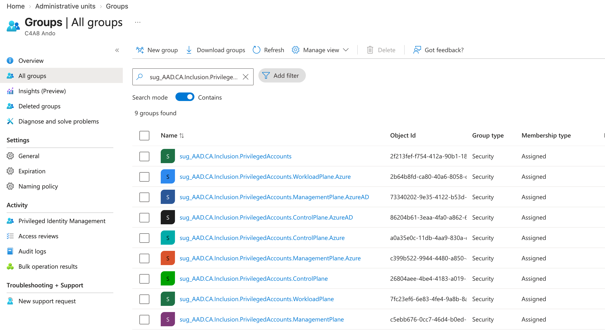
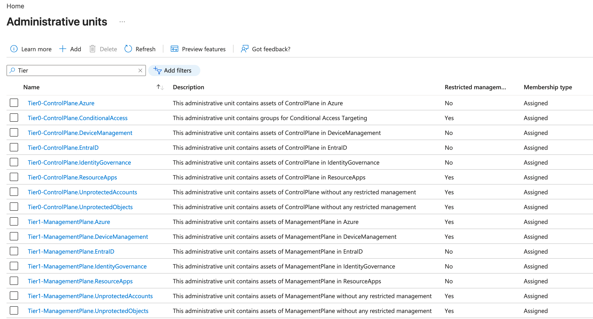

# Privileged EAM

Collect and export classified role assignments across every supported RBAC system, filter and
query the results, customize classification with overwrite files, and let EntraOps automatically
keep the Control Plane scope up to date.

## Supported RBAC systems

Both `Save-EntraOpsPrivilegedEAMJson` (saves to JSON files) and `Get-EntraOpsPrivilegedEAM`
(returns data in-memory) process all supported RBAC systems by default. Use the `-RbacSystems`
parameter to limit the scope:

| Value                | RBAC system                                                                                                                                                       |
| -------------------- | ----------------------------------------------------------------------------------------------------------------------------------------------------------------- |
| `EntraID`            | [Entra ID directory roles](https://learn.microsoft.com/en-us/entra/identity/role-based-access-control/custom-overview) (built-in and custom roles)                |
| `IdentityGovernance` | [Entra ID Governance](https://learn.microsoft.com/en-us/entra/id-governance/identity-governance-overview) (access packages, entitlement management)               |
| `DeviceManagement`   | [Microsoft Intune RBAC](https://learn.microsoft.com/en-us/intune/intune-service/fundamentals/role-based-access-control) (device management roles)                 |
| `ResourceApps`       | [Microsoft Graph API permissions and app roles](https://learn.microsoft.com/en-us/entra/identity-platform/permissions-consent-overview) (application permissions) |
| `Defender`           | [Microsoft Defender XDR Unified RBAC](https://learn.microsoft.com/en-us/defender-xdr/manage-rbac) (security operations roles)                                     |
| `Azure`              | Microsoft Azure RBAC (built-in/custom roles, PIM, constrained delegations)                                                                                        |

### Per-system collector cmdlets

Each RBAC system's role assignment collection is implemented by its own cmdlet, called internally
by `Get-EntraOpsPrivilegedEAM`/`Save-EntraOpsPrivilegedEAMJson`: `Get-EntraOpsPrivilegedEntraIdRoles`
(EntraID), `Get-EntraOpsPrivilegedIdGovRoles` (IdentityGovernance), `Get-EntraOpsPrivilegedDeviceRoles`
(DeviceManagement), `Get-EntraOpsPrivilegedAppRoles` (ResourceApps), `Get-EntraOpsPrivilegedDefenderRoles`
(Defender) and `Get-EntraOpsPrivilegedAzureRoles` (Azure). All of them share
`Get-EntraOpsPrivilegedTransitiveGroupMember` to expand direct and nested group membership,
including eligible/active PIM for Groups assignments.

### Azure RBAC: management-plane actions vs. data-plane actions

Azure RBAC classification matches management-plane `actions`/`notActions` and data-plane
`dataActions`/`notDataActions` independently. A `Classification_Azure.json`/`.Param.json` entry
with `"ActionType": "DataAction"` only matches a role definition's `dataActions`/`notDataActions`;
an entry without `ActionType` only matches `actions`/`notActions`. This keeps a service's
management-plane and data-plane access classified separately - for example, a "Reader" role's
read-only `actions` do not also imply read access to the service's data plane. A role definition's
`*/read` wildcard action no longer satisfies a classification entry for a specific, non-wildcard
read action; the role must grant the concrete action to match. The Classification Explorer's Roles
view shows an info icon on Azure roles explaining this split.

Azure RBAC role assignment collection considers `User`, `Group`, `ServicePrincipal`, `ForeignGroup`
(cross-tenant role-assignable groups resolved via Tenant Governance), `AgentUser` and
`AgentServicePrincipal` (agent identities, e.g. Copilot agents) principal types by default. Azure
RBAC collection itself is powered by `Invoke-EntraOpsAzQuery`, an Azure Resource Manager REST
wrapper with automatic pagination, adaptive throttling/retry handling and `$batch` request
batching for fast tenant-wide collection across every subscription and management group.

### Azure RBAC: constrained delegation (ABAC conditions)

A role that can write role assignments (Role Based Access Control Administrator, User Access
Administrator, Owner) is Control Plane by default, because it can grant Control Plane access. Azure
RBAC role assignment conditions (ABAC) can restrict *which* roles the delegate may assign. When a
condition proves that only less privileged roles can be delegated, EntraOps re-tiers the
`Microsoft.Authorization/roleAssignments` portion of that assignment to the most privileged tier the
condition still allows, and tags it `TaggedBy: "JSONwithConditionInScope"`.

Conditions are read from both the role assignment (`RoleAssignmentCondition`) and the role
definition (`permissions[].condition`, used by built-in constrained roles such as Key Vault Data
Access Administrator). When both are present their allow-lists are intersected, because Azure
evaluates the conditions together.

EntraOps interprets the canonical portal-generated shape, where a negated `ActionMatches` guard
decides which action an allow-list applies to:

```text
(
 ( !(ActionMatches{'Microsoft.Authorization/roleAssignments/write'}) )
 OR
 ( @Request[Microsoft.Authorization/roleAssignments:RoleDefinitionId]
     ForAnyOfAnyValues:GuidEquals {<role definition id>, ...} )
)
```

Two deliberate simplifications apply:

- **`@Request` and `@Resource` are treated the same.** Azure targets `@Request` when a new
  assignment is created (`write`) and `@Resource` when an existing one is removed (`delete`). Which
  action the constraint governs is taken from the `ActionMatches` guard, not from the attribute
  source, so both forms are accepted.
- **The quantifier prefix is not interpreted.** `ForAnyOfAnyValues`, `ForAllOfAllValues` and
  `ForAllOfAnyValues` are all accepted as an allow-list. `RoleDefinitionId` is single-valued in a
  role assignment request, so the quantifiers are equivalent in practice.

Only the constrained `roleAssignments` `write`/`delete` actions are re-tiered. If the same entry also
matched Authorization powers the condition does not restrict - `roleDefinitions/write`,
`elevateAccess/action`, PIM policy writes, or a broad `*` / `Microsoft.Authorization/*` role action -
the entry is split so those remain Control Plane.

Evaluation is fail-closed. The assignment keeps its Control Plane classification when:

| Condition | Reason |
| --- | --- |
| A `GuidNotEquals` deny-list is used | Every role *not* named remains delegable, including Control Plane roles |
| `conditionVersion` is present and is not `2.0` | The expression grammar is not known to be the supported one |
| No negated `ActionMatches` guard is recognised | The boolean structure cannot be interpreted, so the scope of the constraint is unknown |
| The GUID set is empty, or no `RoleDefinitionId` constraint exists | Nothing is actually constrained |
| Any allow-listed role definition cannot be resolved or classified | The reachable tier cannot be proven |
| The allow-list still reaches a Control Plane role | Control Plane access remains delegable |
| The assignment scope is itself a concrete Control Plane scope | Delegation at a Tier 0 resource stays Tier 0 |

An absent or empty `conditionVersion` is treated as `2.0`, since Azure emits `2.0` for every
condition it stores.

Every condition-bearing assignment carries a `ConditionEvaluation` property that records the outcome,
so a classification can be audited without re-running the evaluation:

| Status | Meaning |
| --- | --- |
| `DowngradedConstrainedActions` | The condition was proven to constrain delegation; the constrained actions were re-tiered |
| `RetainedControlPlane` | One of the fail-closed rules above applied, so Control Plane was kept |
| `RetainedControlPlaneByConfiguration` | Re-tiering is disabled through `ClassifyConstrainedDelegationAlwaysAsControlPlane` |
| `AuthorizationNotClassifiedAtScope` | No Control Plane Authorization classification matched the assignment scope, so there was nothing to downgrade |

`AuthorizationNotClassifiedAtScope` is expected for delegation at scopes outside the Control Plane
scope list, where the `Authorization` service is classified as Management Plane. If it appears for a
scope you consider Tier 0, the scope is missing from `Classification_Azure.json` - review the
generated Control Plane scope list rather than the condition itself.

Set `AzureRbacClassification.ClassifyConstrainedDelegationAlwaysAsControlPlane` to `true` in
`EntraOpsConfig.json` to disable the re-tiering entirely and keep every condition-bearing
Authorization assignment at Control Plane.

## Collecting and exporting data

There are two ways to filter the EntraOps results in PowerShell:

### Option A - export to JSON, then load and filter

```powershell
Save-EntraOpsPrivilegedEAMJson -RBACSystems @("EntraID", "ResourceApps")
# Load exported EntraID data for filtering
$EntraOpsData = Get-Content -Raw .\PrivilegedEAM\EntraID\EntraID.json | ConvertFrom-Json
```

### Option B - load directly into a variable (no files saved)

```powershell
$EntraOpsData = Get-EntraOpsPrivilegedEAM
```

A complete list of all existing PowerShell query templates is available as a YAML file in the
[Queries](https://github.com/Cloud-Architekt/EntraOps/blob/main/Queries/PowerShell/PrivilegedEAM.yaml) folder.

Both cmdlets support `-IncludeJustification`: by default, the `Justification` property on a
classification entry is completely omitted from the output (it is only ever populated by a
classification overwrite - see [Customize classification by overwrites](#customize-classification-by-overwrites)).
Add the switch to include it (as `null` when no overwrite justification applies) if you want to
surface the reasoning for a classification change in downstream tooling or reports.

### Create sample data from an export

`Convert-EntraOpsExportToSampleData` creates a relationship-preserving anonymized copy of a
`Classification`, `PrivilegedEAM`, or `TenantGovernance` export. It consistently replaces IDs,
identity names, tenant names, and Azure resource names without changing the source files. Use the
result for demos, troubleshooting, tests, or documentation where production data cannot be shared.

```powershell
Convert-EntraOpsExportToSampleData `
  -SourcePath ./EntraOpsExport `
  -DestinationPath ./EntraOpsSampleData `
  -Seed 'demo-data-v1' `
  -GenerateReports
```

`-Seed` makes the generated aliases deterministic. `-GenerateReports` creates an offline report
bundle from the anonymized export; `-ReportDestinationPath` changes its default location of
`<DestinationPath>/Reports`.

## Filtering examples

### Filter on classification

All privileged objects with Control Plane permissions:

```powershell
$EntraOpsData | Where-Object { $_.RoleAssignments.Classification.AdminTierLevelName -contains "ControlPlane" }
```

All privileged objects with permissions related to "Conditional Access":

```powershell
$EntraOpsData | Where-Object { $_.RoleAssignments.Classification.Service -contains "Conditional Access" }
```

Entra ID custom roles with role actions classified as "Control Plane":

```powershell
$EntraOpsData | Where-Object {$_.RoleSystem -eq "EntraID"} `
| select-Object -ExpandProperty RoleAssignments `
| Where-Object {$_.RoleType -eq "CustomRole" -and $_.Classification.AdminTierLevelName -contains "ControlPlane"}
```

### Filter on classified objects and object details

Administrative Units with assigned privileged objects:

```powershell
$EntraOpsData | Select-Object -ExpandProperty AssignedAdministrativeUnits `
| Select-Object -Unique displayName | Sort-Object displayName
```

External users with privileged role assignments:

```powershell
$EntraOpsData | Where-Object { $_.ObjectSubType -eq "Guest"}
```

Hybrid identities with privileges (excluding the Directory Synchronization service account):

```powershell
$EntraOpsData | Where-Object { $_.OnPremSynchronized -eq $true `
  -and $_.RoleAssignments.RoleDefinitionName -notcontains "Directory Synchronization Accounts" }
```

Privileged objects (e.g., groups or service principals) with privileges and delegations by ownership:

```powershell
$EntraOpsData | Where-Object { $_.Owners -ne $null}
```

Privileged objects without restricted management by role-assignable group membership, Entra ID
role, or RMAU membership (excluding service principals, which are not protected by those features):

```powershell
$EntraOpsData `
  | Where-Object {$_.RestrictedManagementByRAG -ne $True `
    -and $_.RestrictedManagementByAadRole -ne $True `
    -and $_.RestrictedManagementByRMAU -ne $True `
    -and $_.ObjectType -ne "serviceprincipal"}
```

Role assignments by eligible membership in "PIM for Groups" or nested group membership:

```powershell
$EntraOpsData | Select-Object -ExpandProperty RoleAssignments `
 | Where-Object {$_.RoleAssignmentSubType -eq "Eligible member" -or $_.RoleAssignmentSubType -like "*Nested*"} `
 | sort-object RoleAssignmentSubType `
 | ft RoleAssignmentId, RoleAssignmentScopeName, RoleSystem, RoleAssignmentType, RoleAssignmentSubType, PIMAssignmentType, Transitive*
```

Role assignments of privileges without using PIM capabilities (excluding service principals):

```powershell
$EntraOpsData | select-Object -ExpandProperty RoleAssignments `
 | Where-Object {$_.ObjectType -ne "serviceprincipal" -and $_.PIMAssignmentType -ne "Eligible"}
```

## Customize classification by overwrites

EntraOps allows down- or upgrading the classification of individual role actions or entire role
definitions by using overwrite files. This is useful when the shipped classification templates do
not match your operational model. For example, read access to BitLocker recovery keys is
classified as "Control Plane" by default, but might be operated by your device management team and
should be considered "Management Plane" in your environment. Every overwrite entry requires a
`Justification` to document why the classification has been changed, and supports an optional
`Service` which is added as the classification service of the overwritten entry.

Overwrites are supported for the RBAC systems `Azure`, `EntraID`, `DeviceManagement`, `Defender`,
and `IdentityGovernance` (role action overwrites, `Classification_RoleActionOverwrites.json`) and
`ResourceApps` (API permission overwrites, `Classification_ApiPermissionOverwrites.json` - see
below). For `Azure`, the `RoleAssignmentScopeName` of an overwrite entry may also use the literal
tokens `<Tier0IncludedResourceScope>`/`<Tier1IncludedResourceScope>`, which are resolved to the
same ARM scope paths as in `Classification_Azure.Param.json` before the overwrite is applied.

### Overwrite classification of role actions

The file `Classification_RoleActionOverwrites.json` allows you to change the tier level of
individual role definition actions for a given assignment scope. This file is **only** used from
your tenant-specific classification folder (`Classification/<TenantName>/`) alongside the other
customized classification files. A file with this name in the `Templates` folder is intentionally
ignored. An empty skeleton file (`[]`) is created automatically when running
`Update-EntraOpsClassificationControlPlaneScope`.

```json
[
  {
    "RbacSystem": "EntraID",
    "RoleDefinitionActions": ["microsoft.directory/bitlockerKeys/key/read"],
    "RoleAssignmentScopeName": ["/*"],
    "EAMTierLevelName": "ManagementPlane",
    "EAMTierLevelTagValue": "1",
    "Service": "Device Management",
    "Justification": "Read access to BitLocker recovery keys is operated by the device management team and considered Management Plane in this environment."
  }
]
```

Role-action overwrites are applied when the tenant-specific classification file is generated, not
while EAM data is collected. The resulting role assignments are therefore matched like any other
classification-template entry and use `TaggedBy = "JSONwithAction"`. Keep the overwrite file as
the audit record for its justification. `-IncludeJustification` retains a justification only when
the matched classification entry already provides one; generation-time role-action overwrite
justifications are not emitted as separate runtime provenance. Applied overwrites are highlighted
in the classification generation summary:

```
  ↻ Role action overwrite: 'microsoft.directory/bitlockerKeys/key/read' (scope '/*'): ControlPlane → ManagementPlane — Read access to BitLocker recovery keys is operated by the device management team [...]
```

#### Scenario: strict Control Plane scope for Azure RBAC (avoid Management Plane delegation)

`Classification_RoleActionOverwrites.json` can also be used to *narrow* the Management Plane scope
of Azure RBAC classification instead of loosening it. The shipped `Classification_Azure.Param.json`
template classifies Azure RBAC/Blueprints/Lighthouse/Billing/Management Group/Subscription-management
actions as Control Plane only on `<Tier0IncludedResourceScope>`, and additionally allows the same
actions on `<Tier1IncludedResourceScope>` (Management Plane/landing zones) - useful if some of these
actions are still occasionally required outside the Control Plane.

Some environments consequently avoid granting these actions on Management Plane resources at all:
they use Azure RBAC constrained delegations (ABAC conditions), Identity Governance access packages
for granting permissions, and strictly avoid any modification of Management Plane resources outside
of an AzOps/GitOps deployment model. For this operational model, the sample
[Classification_RoleActionOverwrites_AzureStrictControlPlane.json](../../Samples/Classification_RoleActionOverwrites_AzureStrictControlPlane.json)
overwrites the affected services (Authorization, Management Groups, Subscription Management,
Billing, Reservations and Capacity, Azure Lighthouse, Blueprints, Custom Providers) so that these
role actions are **always** classified as Control Plane on scope `/*`, regardless of where they are
assigned - removing the Management Plane carve-out entirely. Copy the entries you need into your
tenant-specific `Classification/<TenantName>/Classification_RoleActionOverwrites.json` and adjust
the `Justification` to your environment.

### Overwrite classification of API permissions (Resource Apps)

The file `Classification_ApiPermissionOverwrites.json` allows you to change the tier level of an
individual API permission (application or delegated permission on Microsoft Graph or other resource
apps), identified by `PermissionValue`. It follows the same schema/field names as an entry of
`Classification_ApiPermissions.json` instead of the role-action/scope-pattern shape used by
`Classification_RoleActionOverwrites.json`. This file is **only** used from your tenant-specific
classification folder (`Classification/<TenantName>/`), same convention as
`Classification_RoleActionOverwrites.json`; a file with this name in the `Templates` folder is
intentionally ignored.

Since the same permission value (e.g. `User.ReadWrite.All`) can theoretically exist on more than
one resource app, or with a different tier depending on whether it is granted as an application or
delegated permission, an entry may optionally define `TargetAppId` (the resource application's
AppId) and/or `PermissionType` (`"Application"`, `"Delegated"` or `"All"`) to pin the overwrite
accordingly. Both are optional: omitting `TargetAppId` matches the permission on any resource app,
and omitting `PermissionType` (or setting it to `"All"`) matches both application and delegated
permissions.

```json
[
  {
    "RbacSystem": "ResourceApps",
    "PermissionValue": "User.ReadWrite.All",
    "PermissionType": "Application",
    "TargetAppId": "00000003-0000-0000-c000-000000000000",
    "Category": "Identity Governance",
    "EAMTierLevelName": "ManagementPlane",
    "EAMTierLevelTagValue": "1",
    "Justification": "Application permission is only granted to a well-governed workload identity with additional Conditional Access controls."
  }
]
```

API permission overwrites are likewise applied only when generating the tenant-specific
`Classification_ApiPermissions.json` (see `Update-EntraOpsClassificationControlPlaneScope`). The
resulting EAM classifications use `TaggedBy = "JSONwithAction"`; retain the overwrite file as the
source of the change rationale. Generation-time API-permission overwrite justifications are not
emitted as separate runtime provenance.

### Overwrite classification of role definitions

The file `Classification_RoleDefinitionOverwrites.json` allows you to change the tier level of an
entire role definition, identified by `RoleDefinitionId` and/or `RoleDefinitionName` with an
optional scope filter (`RoleAssignmentScopeName`). A tenant-specific file in
`Classification/<TenantName>/` is preferred; otherwise, the shipped file in
`Classification/Templates/` is used as a fallback.

The template includes role definitions which cannot be classified by their role actions (e.g.,
"Microsoft Entra Joined Device Local Administrator" grants local administrator permissions on
Entra joined devices without any role action, or "Privileged Authentication Administrator" which
should keep its classification independently of a scoped assignment). These entries were
previously hardcoded (`ControlPlaneRolesWithoutRoleActions`) and can now be customized or
downgraded per tenant.

```json
[
  {
    "RbacSystem": "EntraID",
    "RoleDefinitionId": "9f06204d-73c1-4d4c-880a-6edb90606fd8",
    "RoleDefinitionName": "Microsoft Entra Joined Device Local Administrator",
    "EAMTierLevelName": "ControlPlane",
    "EAMTierLevelTagValue": "0",
    "Service": "Global Endpoint Local Administrator",
    "Justification": "Has permission to become local administrator on Microsoft Entra joined devices but not listed as role action."
  }
]
```

A matched role definition overwrite is tagged with `TaggedBy = "RoleDefinitionOverwrites"`
including the justification. Role definition overwrites are applied at runtime by the EAM cmdlets
for the `EntraID`, `Azure`, `DeviceManagement`, `Defender` and `IdentityGovernance` RBAC systems;
for Azure they are applied after the constrained-delegation evaluation, so an explicit operator
pin always wins. An empty or `"*"` `Service` replaces the assignment's entire
action-based classification with a single overwritten entry (as shown above). A named `Service`
instead replaces or adds only that one classification service, leaving classifications for other
services on the same assignment untouched — for example, to downgrade only the "Global Endpoint
Local Administrator" service of a role while keeping its other classified services unchanged. For
a service-scoped overwrite, `MatchedActions` is populated with the role actions that originally
matched the replaced service (rather than left empty). Applied overwrites are also highlighted in
the summary output of the EAM cmdlets.

> [!WARNING]
> `Update-EntraOpsClassificationControlPlaneScope` can re-apply Control Plane scopes based on identified privileged objects. Review the interaction between automated scope updates and your overwrites to avoid unexpected classification results.

## Classification maintenance tooling

`Update-EntraOpsClassificationModels` regenerates every classification model file in dependency
order and refreshes the Classification Explorer bundle in one orchestrated run - useful after a
Microsoft Graph/Azure schema change, a new custom role, or before a release. It parallelizes the
independent work (the two multi-step lanes keep their internal order):

| Lane                     | Cmdlets                                                                                                                                                                              |
| ------------------------ | ------------------------------------------------------------------------------------------------------------------------------------------------------------------------------------ |
| API permissions          | `Export-EntraOpsClassificationAppRoles` &rarr; `Export-EntraOpsClassificationScopes` &rarr; `Export-EntraOpsClassificationApiPermissions`                                            |
| Entra ID directory roles | `Export-EntraOpsClassificationDirectoryRoles` &rarr; `Export-EntraOpsClassificationDirectoryRolesFromMsftDocs` &rarr; `Get-EntraOpsClassificationDirectoryRolesMismatchFromMsftDocs` |
| Identity Governance      | `Export-EntraOpsClassificationIdentityGovernanceRoles`                                                                                                                               |
| Device Management        | `Export-EntraOpsClassificationDeviceManagementRoles`                                                                                                                                 |
| Azure                    | `Export-EntraOpsClassificationAzureRoles`                                                                                                                                            |

`Export-EntraOpsClassificationDirectoryRolesFromMsftDocs` builds an Entra ID directory role
classification by parsing the public "Microsoft Entra built-in roles" reference from the
MicrosoftDocs/entra-docs repository - it needs internet access to `raw.githubusercontent.com` but
no Microsoft Graph connection. `Get-EntraOpsClassificationDirectoryRolesMismatchFromMsftDocs` then
diffs that Docs-based classification against the Graph-based one, highlighting role action
differences per role and any action left `Unclassified` in either source.

The directory-role classification keeps `Categories` in the scalar representation exposed by
Microsoft Graph. A role with multiple categories therefore uses one comma-delimited string, such as
`"Collaboration,Identity"`, rather than a JSON array. The Microsoft Docs-derived export uses the
same representation so both sources remain directly comparable.

After every lane finishes, `Update-EntraOpsClassificationExplorerData -Mode Standalone` regenerates
the embedded Classification Explorer data bundle (classification data, attack paths, EAM Map
dataset and git-log-based change history). A live progress bar and a final summary are printed,
listing every unclassified action/permission per source and the Microsoft Docs mismatch, formatted
so the lists can be pasted directly into a classification JSON file or an AI prompt.

```powershell
Update-EntraOpsClassificationModels
```

## Classification of Identity Governance delegation and roles

Microsoft Entra Identity Governance allows you to [delegate and grant roles](https://learn.microsoft.com/en-us/entra/id-governance/entitlement-management-delegate)
at the catalog level. There are two methods of classifying those delegations in EntraOps:

- TaggedBy "`JSONwithAction`": define the classification by scope and role in the classification template file [Classification_IdentityGovernance.json](https://github.com/Cloud-Architekt/EntraOps/blob/main/Classification/Templates/Classification_IdentityGovernance.json) manually. The schema mirrors the other classification templates and offers flexible tagging for your Tiered Administration Level and Service.
- TaggedBy "`Assigned*`": EntraOps collects the classification data of resources assigned in a catalog and applies that classification to the scope of the delegated role. Concrete provenance tags identify the resource type, such as `AssignedAadGroup`, `AssignedOAuthApplicationResource`, `AssignedDirectoryRoleResource`, or `AssignedAzureResourcesResource`. This needs no further manual tagging and ensures that privileged or role-assignable groups are identified in access packages and catalogs. Any delegation to this scope inherits the `TierLevelDefinition` of the assigned resource.

For additional access-package resource origins, EntraOps applies the following tiering:

- **AadApplication** resources inherit their service principal's `ResourceApps` EAM classification. A known application without privileged permission classifications is `UserAccess`; an application that cannot be resolved fails closed to `ControlPlane` and produces a warning. Generate `ResourceApps` EAM data alongside `IdentityGovernance` when access packages contain application resources.
- **SharePointOnline** resources are tiered from their assigned site role. Owners, Full Control, site-collection administration and design roles are `ManagementPlane`; Member, Visitor, Read and Edit roles are `UserAccess`. The default SharePoint site-group IDs preserve this distinction for localized role names. Unknown roles and catalog-level SharePoint resources conservatively remain `ManagementPlane`.

Example of an Identity Governance role classified by both the classification template file (JSON)
and the assigned objects:

```json
"RoleAssignments": [
      {
        "RoleAssignmentId": "58c673ff-dc05-4038-9a59-826e777289c2",
        "RoleAssignmentScopeId": "/AccessPackageCatalog/5279fb65-7ccf-460b-8893-75087b855588",
        "RoleAssignmentScopeName": "Privileged Access - Helpdesk Delegation to change passwords of admins",
        "RoleAssignmentType": "Direct",
        "RoleAssignmentSubType": "",
        "PIMManagedRole": false,
        "PIMAssignmentType": "Permanent",
        "RoleDefinitionName": "Catalog owner",
        "RoleDefinitionId": "ae79f266-94d4-4dab-b730-feca7e132178",
        "RoleType": "BuiltIn",
        "RoleIsPrivileged": null,
        "ObjectId": "f742b7a6-d2b6-497d-9443-215505d5998a",
        "ObjectType": "user",
        "TransitiveByObjectId": "",
        "TransitiveByObjectDisplayName": "",
        "Classification": [
          {
            "AdminTierLevel": "0",
            "AdminTierLevelName": "ControlPlane",
            "Service": "Entitlement Management",
            "TaggedBy": "JSONwithAction"
          },
          {
            "AdminTierLevel": "0",
            "AdminTierLevelName": "ControlPlane",
            "Service": "Privileged User Management",
            "TaggedBy": "AssignedAadGroup"
          }
        ]
      }
  ]
```

### Identify delegated management with different classifications

The following PowerShell query helps identify delegated roles on catalogs held by a user whose own
classification does not match the assigned resources - for example, a regular user has access as
"Catalog owner" which includes resources of role-assignable groups with Entra ID role assignments.

```powershell
$ElmCatalogAssignments = $EntraOpsData | where-object {$_.RoleSystem -eq "IdentityGovernance"} `
                            | Select-Object -ExpandProperty RoleAssignments `
                            | Where-Object {$_.Classification.TaggedBy -like "Assigned*"}
foreach($ElmCatalogAssignment in $ElmCatalogAssignments){
    $PrincipalClassification = $EntraOpsData | Where-Object {$_.ObjectId -eq $ElmCatalogAssignment.ObjectId} `
                                | Where-Object {$_.RoleSystem -ne "IdentityGovernance"} `
                                | Select-Object -ExpandProperty RoleAssignments `
                                | Select-Object -ExpandProperty Classification `
                                | Select-Object -Unique AdminTierLevelName, Service `
                                | Sort-Object -Property AdminTierLevelName, Service
    if ($null -eq $PrincipalClassification) {
        Write-Warning "No Principal Classification found for $($ElmCatalogAssignment.ObjectId)"
        $PrincipalClassification = @(
            [PSCustomObject]@{
                AdminTierLevelName = "User Access"
                Service = "No Classification"
            }
        )
    }
    $ElmCatalogClassification = $ElmCatalogAssignment | Select-Object -ExpandProperty Classification `
                                | Where-Object {$_.TaggedBy -like "Assigned*"} `
                                | Select-Object -Unique AdminTierLevelName, Service `
                                | Sort-Object -Property AdminTierLevelName, Service                              

    $Differences = Compare-Object -ReferenceObject ($ElmCatalogClassification) `
    -DifferenceObject ($PrincipalClassification) -Property AdminTierLevelName, Service `
    | Where-Object {$_.SideIndicator -eq "<="} | Select-Object * -ExcludeProperty SideIndicator
    if ($null -ne $Differences) {
        try {
            $Principal = Get-EntraOpsEntraObject -AadObjectId $ElmCatalogAssignment.ObjectId    
        }
        catch {
            $Principal = [PSCustomObject]@{
                ObjectDisplayName = "Unknown"
                ObjectType = "Unknown"
            }
        }
    }
    if ($Differences) {
        $Differences | ForEach-Object {
                [PSCustomObject]@{
                    "PrincipalName" = $Principal.ObjectDisplayName
                    "PrincipalType" = $Principal.ObjectType
                    "RoleAssignmentId" = $ElmCatalogAssignment.RoleAssignmentId
                    "RoleAssignmentScopeId"  = $ElmCatalogAssignment.RoleAssignmentScopeId
                    "RoleAssignmentScopeName"  = $ElmCatalogAssignment.RoleAssignmentScopeName
                    "AdminTierLevelName" = $_.AdminTierLevelName
                    "Service" = $_.Service
                }
        }
    }
}
```

## Automatic updated Control Plane scope

EntraOps offers an optional feature (`ApplyAutomatedControlPlaneScopeUpdate`) to identify highly
sensitive privileged assignments from other sources and adjust the Control Plane scope based on
restricted management. `Update-EntraOpsClassificationControlPlaneScope` gathers this data via
`Get-EntraOpsClassificationControlPlaneObjects`, which can also be called directly to retrieve the
deduplicated list of Control Plane objects (with their source and reason) without writing any
scope files.

> [!NOTE]
> Azure resources hosting a managed identity (resolved via `Get-EntraOpsManagedIdentityAssignments`) are bucketed into the Tier0 or Tier1 resource scope
> based on the identity's most privileged classified tier in the loaded EAM data. Only an identity
> whose tier could not be evaluated at all (empty/`Unknown`) defaults to Tier0 (fail closed). An
> identity that was evaluated but has no privileged classification (`Unclassified`) intentionally
> **falls back to Tier1** so it does not widen the Control Plane. Keep the EAM exports for all
> configured `EntraOpsScopes` current: a stale or missing export can make a genuinely privileged
> managed identity appear `Unclassified` and land its host resource in Tier1.

> [!TIP]
> Watch a [walkthrough of this feature](https://cloud-architekt.github.io/assets/images/entraops/setup_2-cpupdate.gif).

A few examples of use cases and benefits when combining this feature with the supported data
sources:

### Azure Resource Graph

Including `"PrivilegedRolesFromAzGraph"` in the `PrivilegedObjectClassificationSource` property of
the `EntraOpsConfig.json` file gathers privileged role assignments from the Azure Resource Graph. The
`AzureHighPrivilegedRoles` and `AzureHighPrivilegedScopes` properties define which Azure RBAC roles
and assignment scopes are used to discover Control Plane principals. This is a privileged-principal
discovery input for Control Plane scope updates; it does not classify Azure role actions or resource
scopes in `Classification_Azure.json`. Every delegation with a matching Azure RBAC role assignment
is identified as Control Plane - for example, a Group Administrator of the Entra ID security group
assigned to the "Owner" role on the Tenant Root Group.

When scopes are configured, EntraOps matches the Azure RBAC assignment scope **exactly**. A management
group or subscription entry does not include its child management groups, subscriptions, resource groups,
or resources; list each intended assignment scope explicitly. Use `"*"` only when every scope is
intended. The generated `ScopeReasoning_ControlPlane.json` records the configured roles/scopes and,
for each Azure Resource Graph match, the `RoleName` and exact `RoleScope` that caused classification.

The following Resource Graph query is used (`%AzureHighPrivilegedRoles%` and the scope are replaced
by the values in `EntraOpsConfig.json`):

```kusto
AuthorizationResources
| where type =~ "microsoft.authorization/roleassignments"
| extend principalType = tostring(properties["principalType"])
| extend principalId = tostring(properties["principalId"])
| extend roleDefinitionId = tolower(tostring(properties["roleDefinitionId"]))
| extend scope = tolower(tostring(properties["scope"]))
| where scope in (%AzureHighPrivilegedScopes%)
| join kind=inner ( AuthorizationResources
| where type =~ "microsoft.authorization/roledefinitions"
| extend roleDefinitionId = tolower(id)
| extend Scope = tolower(properties.assignableScopes)
| extend RoleName = (properties.roleName)
| where RoleName in (%AzureHighPrivilegedRoles%)
) on roleDefinitionId
| project principalId, principalType, scope, RoleName
```

### Microsoft Security Exposure Management

Critical assets defined in Microsoft Security Exposure Management (XSPM) can be integrated using
the value `"PrivilegedEdgesFromExposureManagement"` in the `PrivilegedObjectClassificationSource`
property. You can also filter with `ExposureCriticalityLevel` to select which "tier" classification
in XSPM's critical asset management is included. The following hunting query is used to identify
high-privileged nodes (`%CriticalLevel%` is replaced by the value in `EntraOpsConfig.json`):

```kusto
let Tier0Assets = ExposureGraphNodes
  | where isnotnull(NodeProperties.rawData.criticalityLevel) and (NodeProperties.rawData.criticalityLevel.criticalityLevel %CriticalLevel%)
  | where (NodeLabel != "device" and parse_json(Categories) !has "identities")
    or (NodeProperties.rawData.primaryProvider == "AzureActiveDirectory")
    or (NodeLabel == "device" and NodeProperties.rawData.isAzureADJoined == true)
  | project NodeId;
let SensitiveRelation = dynamic(["has permissions to","can authenticate as","has role on","has credentials of","affecting", "can authenticate as", "Member of", "frequently logged in by"]);
// Devices are not supported yet, no AadObject Id available in ExposureGraphNodes, DeviceInfo shows only AadDeviceId
let FilteredNodes = dynamic(["user","group","serviceprincipal","managedidentity","device"]);
let SensitiveEdges = ExposureGraphEdges
  | where EdgeLabel in (SensitiveRelation) and SourceNodeLabel in (FilteredNodes)
  | where TargetNodeId in (Tier0Assets) or SourceNodeId in (Tier0Assets);
let SensitiveSourceNodeIds = SensitiveEdges | distinct SourceNodeId;
SensitiveEdges
| join kind=leftouter ( ExposureGraphNodes
  | where NodeId in (SensitiveSourceNodeIds)
    | mv-expand parse_json(EntityIds)
    | where parse_json(EntityIds).type == "AadObjectId"
    | extend AadObjectId = tostring(parse_json(EntityIds).id)
    | extend TenantId = extract("tenantid=([\\w-]+)", 1, AadObjectId)
    | extend ObjectId = extract("objectid=([\\w-]+)", 1, AadObjectId)
    | project ObjectDisplayName = NodeName, ObjectType = NodeLabel, ObjectId, NodeId) on $left.SourceNodeId == $right.NodeId
| where isnotempty(ObjectId)
  | extend ClassificationReason = bag_pack_columns(EdgeLabel, TargetNodeName)
  | summarize by ObjectDisplayName, SourceNodeName, tolower(ObjectType), ObjectId, NodeId, tostring(ClassificationReason)
```

As described above, any Entra ID role assignment on the scope of critical assets in XSPM is
classified as Control Plane.

### Adjusted Control Plane scope by using restricted management and role assignments

There are several integrated protection capabilities for privileged assets in Entra ID to avoid
management from lower-privileged roles. For example, Restricted Management AUs protect sensitive
security groups from membership changes by Group Administrators, or protect the password reset of
users with Entra ID roles from Helpdesk Administrators. EntraOps identifies whether objects are
protected by these features, or only scoped delegations (excluding privileged assets) have been
assigned. In that case, the Control Plane scope is automatically updated and customized for your
environment. For example: Group Administrator at directory level is not classified as "Control
Plane" if all privileged groups with assignments on Control Plane privileges are protected by RMAU
or role-assignable groups.

### EntraOpsScopes vs. ClassificationParameterScope

`Update-EntraOpsClassificationControlPlaneScope` (driven by the `AutomatedControlPlaneScopeUpdate`
section of `EntraOpsConfig.json`) has two array settings that are easy to confuse because both accept
the same kind of RBAC system names (`Azure`, `EntraID`, `IdentityGovernance`, `DeviceManagement`,
`ResourceApps`, `Defender`, ...), but they control opposite ends of the same run:

- **`EntraOpsScopes`** selects which RBAC systems' **already-classified EAM export data is read as
  input**. It determines which `Classification/<TenantName>/<Scope>.json` files are loaded to figure
  out which objects/resources are currently Control Plane or Management Plane, so their protection
  status (RMAU, Entra ID role, role-assignable group) can be evaluated. `EntraOpsScopes` also
  supports `AzureBilling`, which the other setting does not.
- **`ClassificationParameterScope`** selects which RBAC systems' **classification template/parameter
  files are (re)written as output** during that same run - for example substituting the
  `<Tier0IncludedResourceScope>`/`<Tier1IncludedResourceScope>` placeholders in
  `Classification_Azure.Param.json`, or updating Intune scope tag group placeholders in
  `Classification_DeviceManagement.Param.json`.

In short: `EntraOpsScopes` is "what data do I read to figure out what's privileged", while
`ClassificationParameterScope` is "which classification files do I regenerate with that
information". Both default to (nearly) every supported RBAC system, so most environments never need
to change them - narrow them only if you want to limit the update to specific RBAC systems (e.g.
only regenerate the Azure classification file without touching Entra ID's).

## Automated protection of privileged assets

Beyond classification, EntraOps can automatically apply Zero Trust protections to the privileged
assets it identifies - each is opt-in via its own `EntraOpsConfig.json` setting and requires the
matching Microsoft Graph permission (granted by `New-EntraOpsWorkloadIdentity` only when the
setting is enabled):

- **Conditional Access target groups** (`AutomatedConditionalAccessTargetGroups`, cmdlets `New-EntraOpsPrivilegedConditionalAccessGroup` / `Update-EntraOpsPrivilegedConditionalAccessGroup`): creates and maintains security groups per tier for targeting Conditional Access policies, scoped to an Administrative Unit named by `AdminUnitName`.



- **Administrative Unit management** (`AutomatedAdministrativeUnitManagement`, cmdlets `New-EntraOpsPrivilegedAdministrativeUnit` / `Update-EntraOpsPrivilegedAdministrativeUnit`): creates and maintains Administrative Units based on the selected EntraOps tiering, adding all supported privileged users and groups. `RestrictedAuMode` controls whether a Restricted Management AU (RMAU) is created for RBAC systems outside of Microsoft Entra (which typically have no role-assignable groups of their own).


- **RMAU assignment for unprotected objects** (`AutomatedRmauAssignmentsForUnprotectedObjects`, cmdlets `New-EntraOpsPrivilegedUnprotectedAdministrativeUnit` / `Update-EntraOpsPrivilegedUnprotectedAdministrativeUnit`): adds every privileged user or group that has no existing restricted management (no role-assignable group membership, Entra ID role, or RMAU membership) to an RMAU named "UnprotectedObjects". Set `IncludeUnprotectedDevices` to also add devices owned by or associated with privileged users, unless another RMAU already protects the device. Device synchronization only considers owners in the connected tenant and skips devices that cannot be resolved there. The cmdlet reports any failed RMAU membership operation in its summary and then returns an error so automated workflows can fail visibly.
- **Entitlement Management catalog protection** (`AutomatedElmCatalogProtection.ApplyPrivilegedElmCatalogProtection`, cmdlet `Update-EntraOpsPrivilegedUnprotectedElmCatalog`): syncs the privilege level of Identity Governance Entitlement Management (access package) catalogs to match their EntraOps classification - a catalog classified as Control Plane scope is protected as "privileged" (stricter write/assignment controls), an already-protected catalog is left unchanged, and a catalog that is no longer in Control Plane scope is reverted to "standard".

### Removal safety brake

The mutating update cmdlets protect against a degraded classification input removing protections wholesale. `Update-EntraOpsPrivilegedConditionalAccessGroup`, `Update-EntraOpsPrivilegedAdministrativeUnit`, `Update-EntraOpsPrivilegedUnprotectedAdministrativeUnit`, and `Update-EntraOpsPrivilegedUnprotectedElmCatalog` plan all eligible removals for each target before mutation. By default, a plan exceeding 50% of the current protected set applies no removals to that target, records an `ABORTED` summary status, and fails the command after the summary so automation cannot silently succeed. Independent additions and protection operations may still proceed.

`RemovalSafetyThreshold` is persisted in all four automated-protection sections of `EntraOpsConfig.json` and can also be supplied as `-RemovalSafetyThreshold <0..1>`. A value of `1.0` permits removal of the complete current protected set, which disables threshold-based `SafetyAbort` protection for automated runs. Use this only when the customer intentionally accepts that risk; `0.5` remains the default. After inspecting the reported plan, use `-ForceRemovalBeyondSafetyThreshold` to apply a deliberate oversized reconciliation. The force switch is invocation-only and intentionally unavailable in the Configuration Wizard.

> [!IMPORTANT]
> Entitlement Management catalog protection requires the elevated Microsoft Graph permission `EntitlementManagement.ReadWrite.All`, and EntraOps cannot distinguish a catalog it protected from one an administrator protected manually - a catalog without Control Plane scope in EntraOps is reverted to "standard" either way. Updating the privilege level protects the catalog itself, but existing role assignments on it remain classified as Control Plane and should still be reviewed and removed.

See [Get Started &rarr; Review and customize configuration](../get-started/index.html#step-6-review-and-customize-the-entraopsconfig-file) for where these settings fit into initial setup.
