# Reportings

The static EntraOps Reporting apps, Microsoft Sentinel/Unified SecOps Platform integration, and the
BloodHound OpenGraph integration for attack path management.

## Reporting apps {#entraops-reporting-apps}

EntraOps ships a small portal of **static, self-contained web apps** (`Reports/`) to explore
classification data, analyze tier boundary violations and review privileged identities - no
backend, database or web server required; each app embeds its generated data as a JavaScript
bundle and works offline from `file://`. Open [Reports/index.html](../../Reports/index.html) as
the landing page, which links to all apps and their cross-navigation.

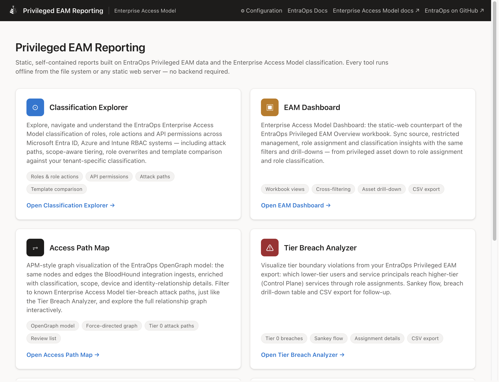

> **Prerequisite:** Most reporting apps are built from a Privileged EAM export. If you have not
> collected data yet, run `Save-EntraOpsPrivilegedEAMJson` first. Accepted `-RbacSystems` values
> are `Azure`, `EntraID`, `IdentityGovernance`, `DeviceManagement`, `ResourceApps`, and `Defender`.
>
> ```powershell
> Save-EntraOpsPrivilegedEAMJson -RbacSystems @("EntraID", "Azure")
> ```

Generate or refresh the data for all apps in one call:

```powershell
Import-Module ./EntraOps -Force
New-EntraOpsReportingData
```

For configuration-driven automation on any CI platform, use the higher-level command:

```powershell
Import-Module ./EntraOps -Force
Invoke-EntraOpsReportingGeneration -ConfigFilePath ./EntraOpsConfig.json `
  -AuthenticationType AlreadyAuthenticated
```

It reads the `AutomatedReportingGeneration` settings, reuses one Graph connection for the selected
reports, applies the configured object-resolution and history options, and fails the automation run
when a selected generator fails. Checkout, workload-identity bootstrap, report testing, artifact
upload, and release publication remain responsibilities of the surrounding GitHub Actions, GitLab CI,
Azure Pipelines, or local runner. If no Tenant Governance snapshot manifest exists, Configuration
Analyzer is skipped with a warning, matching the shipped workflow behavior.

> **Shipped automation.** `Invoke-EntraOpsReportingGeneration` is already wired into the v1.1
> pipelines — you do not need to call it manually in CI:
> - **GitHub Actions:** `.github/workflows/Push-EntraOpsPrivilegedReporting.yaml`
> - **Azure DevOps:** `.azure-pipelines/azure-pipelines-push-reporting.yml`
> Both pipelines read `EntraOpsConfig.json`, establish the required authentication context, invoke
> the cmdlet, run the Playwright smoke-test suite, and publish the `Reports/` artifact.

- `New-EntraOpsClassificationExplorerData` / `New-EntraOpsTierBreachAnalyzerData` / `New-EntraOpsPrivilegedEamDashboardData` / `New-EntraOpsPrivilegedEamPrivilegeHistoryData` / `New-EntraOpsAccessPathMapData` / `New-EntraOpsTenantGovernanceConfigurationAnalyzerData` generate the data bundle for the individual apps. `New-EntraOpsReportingData` is a convenience wrapper that runs them in one call and can also generate Access Package Flow enrichment. It forwards parameters such as `-ClassificationExplorerRepoRoot`, `-TierBreachImportPath`, `-EamDashboardImportPath`, `-AccessPathMapImportPath`, `-SkipClassificationExplorer`, `-SkipTierBreachAnalyzer`, `-SkipEamDashboard`, `-SkipPrivilegeHistory`, `-SkipAccessPathMap`, `-SkipConfigurationAnalyzer`, and `-SkipAccessPackageFlow`.
- `Remove-EntraOpsReportingData` deletes the generated data bundles again (`-WhatIf`, the same seven `-Skip*` switches, and `-PassThru` are supported). Run it before sharing or committing a checkout to remove tenant-specific reporting data.
- Reporting generation can be automated with the `AutomatedReportingGeneration` section in `EntraOpsConfig.json` (set with `New-EntraOpsConfigFile -ApplyAutomatedReportingGeneration`) and the `Push-EntraOpsPrivilegedReporting` GitHub workflow. The workflow regenerates the selected apps, runs the offline browser smoke suite, and uploads a 30-day build artifact in a private repository only when every report passes. A failing smoke test is reported in the workflow log and blocks the artifact upload; no artifact is produced for a failed run because report traces would contain tenant data. GitHub Release publishing is a separate, disabled-by-default option (`PublishReportsAsRelease`); when enabled, `ReportingReleasesToKeep` limits retained `reporting-*` releases because each release contains a full tenant-data snapshot.

### Classification Explorer

[Reports/ClassificationExplorer](../../Reports/ClassificationExplorer/README.md) lets you browse
and understand the Enterprise Access Model classification of roles, role actions and permissions
across Microsoft Entra ID, Azure and Intune RBAC systems: an overview dashboard, roles, role
actions, API permissions, scope-aware tiering, role overwrites and a library of documented attack
paths (with an interactive, BloodHound-style graph). A **Template Comparison** view diffs the
repository's tenant classification against the upstream `Classification/Templates`, highlighting
reclassified role actions/scopes and access-level distribution changes. Entra ID roles are also
compared against the public Microsoft Learn role reference to flag documentation mismatches, and a
**Customize Overwrites** editor lets you build `Classification_RoleDefinitionOverwrites.json` /
`Classification_RoleActionOverwrites.json` / `Classification_ApiPermissionOverwrites.json`
interactively.

The **Change History** view and its notifications are derived from a git log over the
classification sources. Because those sources live in the sparsely checked out
AzurePrivilegedIAM repository, generation is disabled by default. Set
`ClassificationExplorer.GenerateChangeHistory` in `EntraOpsConfig.json` to `true` (or run
`New-EntraOpsClassificationExplorerData -SkipHistory:$false`) to generate it. A missing setting or
configuration file also skips the history.

The reporting workflow uses this setting only to select checkout depth: a shallow checkout when
history is disabled, or the full git history when it is enabled. The cmdlet reads the configuration
itself, so an existing workflow continues to produce the configured result after an EntraOps module
update. Because workflow files are excluded from automated updates by default, refresh
`Push-EntraOpsPrivilegedReporting.yaml` manually to gain the shallow-checkout optimization in an
existing deployment.

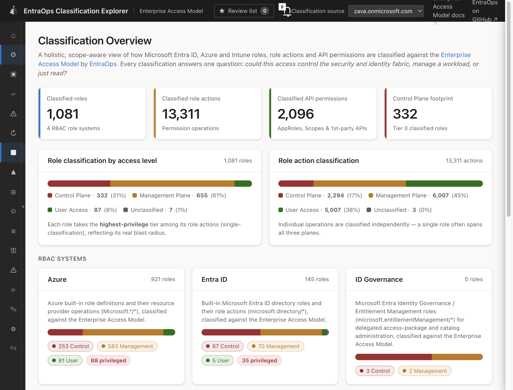

### EAM Dashboard

[Reports/EamDashboard](../../Reports/EamDashboard/README.md) is the static-web counterpart of the
*EntraOps Privileged EAM - Overview* Azure workbook, built entirely from your Privileged EAM
export - no Log Analytics workspace or Azure subscription required. It offers the same filters
(RBAC system, tier level, service, principal type, linked identity, privileged type - Tenant
Governance / Multi-Tenant Apps / B2B Collaboration / Local Identities - and free-text search),
cross-filterable sync-source, restricted-management, assignment-type and classification tiles, and
three drill-down grids (privileged assets, related role assignments, related role classification),
all with CSV export.

Prerequisite: a Privileged EAM export must exist (see the prerequisite note above). Generate the
dataset with `New-EntraOpsPrivilegedEamDashboardData` (or `New-EntraOpsReportingData`).

The dashboard's drill-down view keeps privileged assets, assignments, and their classification
evidence together for investigation and export.

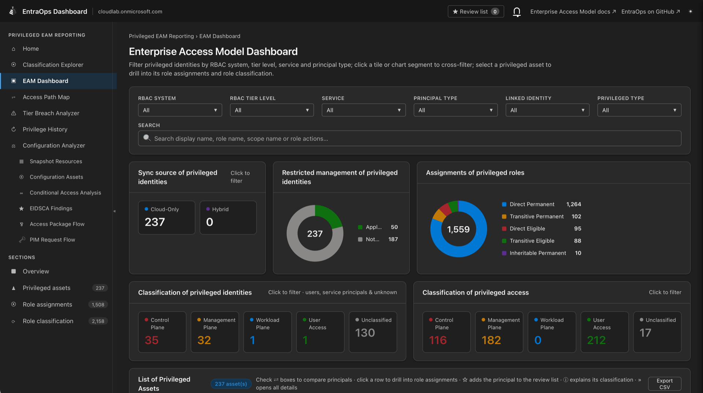

### Access Path Map

[Reports/AccessPathMap](../../Reports/AccessPathMap/README.md) renders the OpenGraph model consumed
by the [BloodHound integration](#bloodhound-integration), plus Azure RBAC role and assignment data
synthesized from `PrivilegedEAM/Azure/Azure.json`, as an interactive, APM-style, force-directed
graph. It offers Tier 0 / all-tier-breach / full-graph views (matching the Tier Breach Analyzer's
tiering rules), a curated **known/documented attack path** filter
cross-referenced with the Classification Explorer's attack-path catalog, scope and
classification-provenance drill-down ("Other privileged objects sharing this scope", "Show full
context in graph"), a right-click context menu on graph nodes, bookmarkable node/edge selections
via URL hash, and a CSV-exportable attack path table.

Prerequisite: a Privileged EAM export must exist (see the prerequisite note above), including
`PrivilegedEAM/Azure/Azure.json` if you want Azure RBAC visualization. Generate the dataset with
`New-EntraOpsAccessPathMapData` (or `New-EntraOpsReportingData`).

Azure RBAC assignments are fully represented in Access Path Map as `EO_AzureRole` and
`EO_AzureRoleAssignment` nodes with active, eligible, assignment, ownership and scope-reasoning
edges. This Azure-specific synthesis is performed by `New-EntraOpsAccessPathMapData`; it is
additional to the payload produced by the standalone BloodHound exporter.

Object ids referenced only via ownership/sponsor/device edges (e.g. a regular work account that
owns a privileged group) are resolved by default through a batched live Microsoft Graph lookup.
This requires an active Graph connection when the data is generated (e.g. via
`Connect-EntraOps`/`Connect-MgGraph`). Resolution is best-effort: objects that Graph cannot return
remain explicit unresolved placeholders, and their graph edges are preserved. Set
`AccessPathMap.ResolveObjectIdsOutsidePrivilegedEAM` to `false` to disable the lookup. The generator
reports the lookup duration and recommends disabling it when resolution takes 30 seconds or longer.

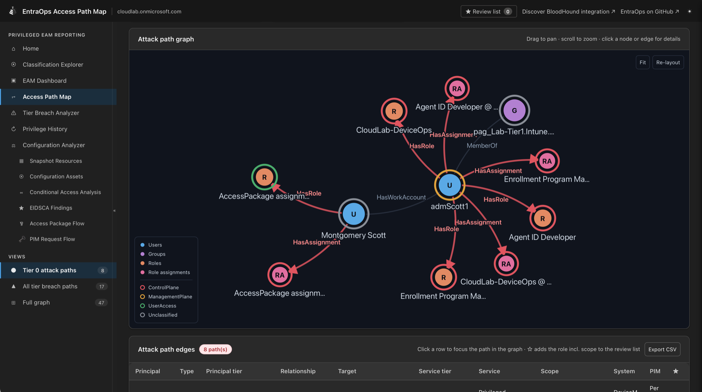

### Tier Breach Analyzer

[Reports/TierBreachAnalyzer](../../Reports/TierBreachAnalyzer/README.md) visualizes Enterprise
Access Model **tier boundary violations** from a Privileged EAM export as a Sankey flow -
`Object Tier -> Object -> Role -> Service -> Service Tier`. It highlights Tier 0 breaches (a Tier 1
/ Tier 2 object reaching a Control Plane service), and offers filterable views (Tier 0 breaches,
all tier breaches, all assignment paths), a detailed breach table with PIM/transitivity context,
and CSV export for follow-up.

1. Export the Privileged EAM data (skip this if the export already exists):

   ```powershell
   Save-EntraOpsPrivilegedEAMJson -RbacSystems @("EntraID", "Azure")
   ```

2. Generate the Tier Breach Analyzer dataset:

   ```powershell
   New-EntraOpsTierBreachAnalyzerData
   ```

The detailed analysis view connects the selected tier-breach path to its underlying assignments
and classification context for follow-up.

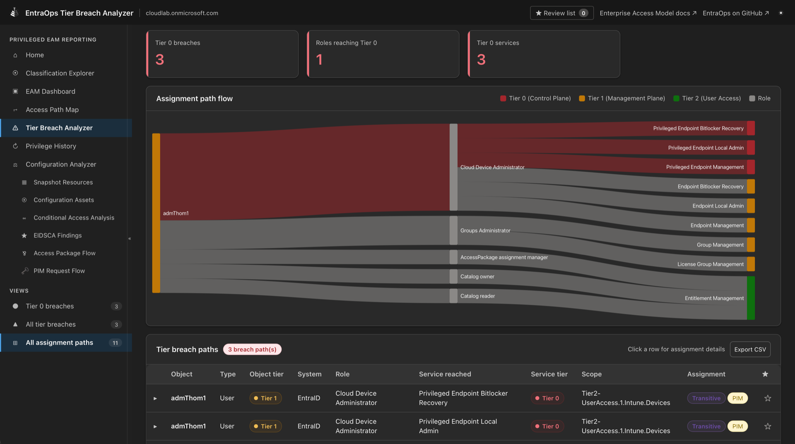

### Privilege History

[Reports/PrivilegeHistory](../../Reports/PrivilegeHistory/README.md) shows historic trends of
privileged assets, role assignments and tier breaches over time, built entirely from the git
history of your Privileged EAM export - no separate time-series store required. Filter by RBAC
system, tier level and role, pick a time range, inspect any snapshot and compare two points in time
(or a point vs. today's live data via the EAM Dashboard).

Select a snapshot to review its tier totals and assignments, then compare it directly with today's
live data in the EAM Dashboard to identify changes requiring investigation.

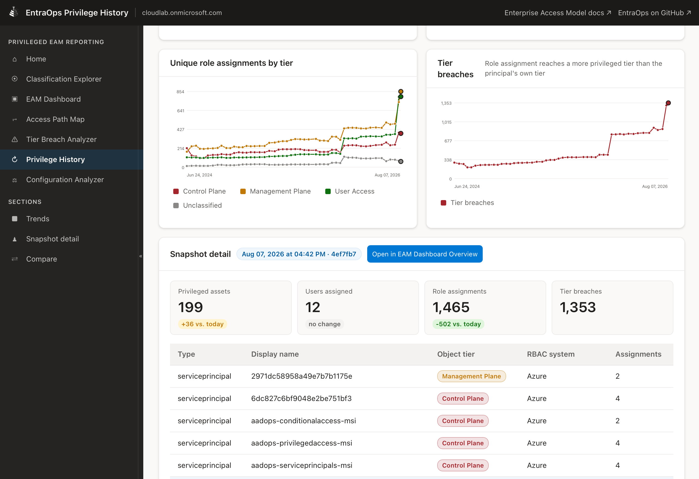

The history view also summarizes how privileged identity and assignment counts change across the
selected time range.

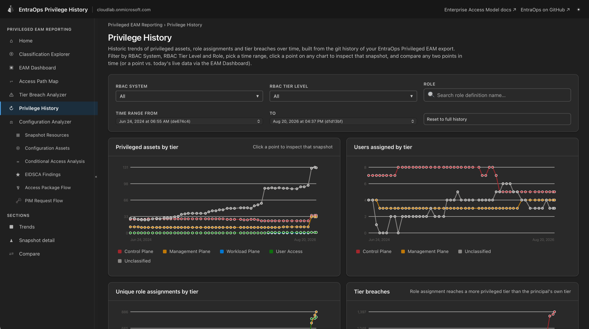

The reporting workflow is controlled by
`AutomatedReportingGeneration.GeneratePrivilegeHistory`. For direct calls to
`New-EntraOpsReportingData`, `PrivilegeHistory.EnablePrivilegeHistory` (default enabled) turns
generation on or off, `PrivilegeHistory.TimeRangeInDays` limits how far back into the git history
it samples (default: unlimited), and `PrivilegeHistory.SnapshotInterval` sets how often a snapshot
is sampled (default `P2W`, an ISO 8601 duration for every 2 weeks).

### Configuration Analyzer

[Reports/ConfigurationAnalyzer](../../Reports/ConfigurationAnalyzer/README.md) analyzes the
[Tenant Governance Snapshots](../tenant-governance/index.html#tenant-governance-snapshots) captured under
`TenantGovernance/Snapshots` - like Privilege History, it is built entirely from the **git
history** of your repository, so every committed snapshot becomes a point in time you can inspect
and compare:

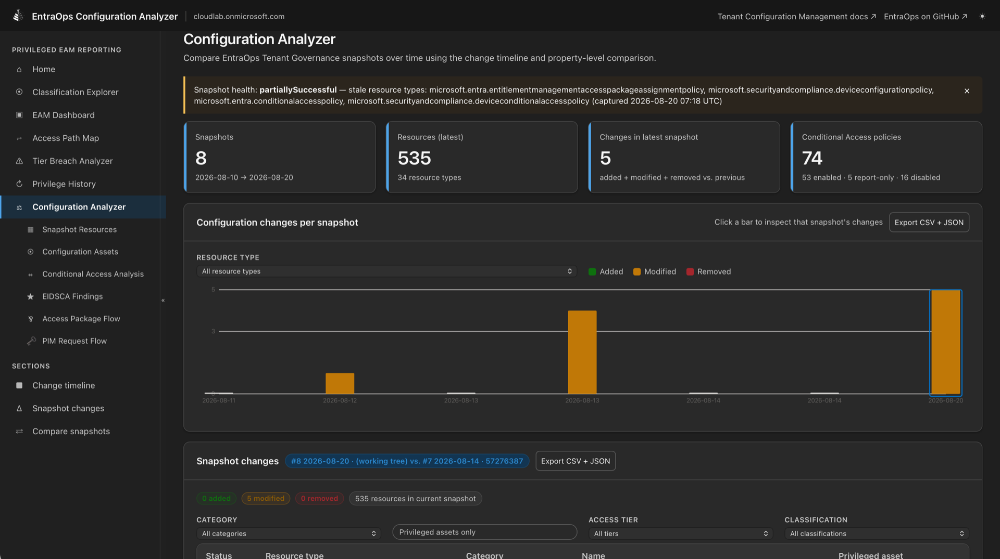

- **Change timeline**: how many resources were added, modified or removed per snapshot, filterable
  by resource type. Click a snapshot to list every changed resource, and drill into a modified
  resource to see a property-level diff (old vs. new value).
- **Compare two snapshots**: pick any baseline and current snapshot (e.g. "before/after the
  change window last month") and get the same change list and property-level diffs between exactly
  those two points in time. Use this to validate an intended configuration deployment or investigate
  drift after an incident without maintaining a separate historical configuration store.
- **Snapshot Resource Explorer**: browse captured resources in expandable resource-type folders,
  search by name, category, or type, and move between matching resources without leaving the detail
  pane. The grouped property view presents nested collections as **Entries** and structured values
  as **Fields**, with controls to expand or collapse the complete property tree.
- **Conditional Access Sankey**: visualizes how the tenant's Conditional Access policy set is
  configured as a flow of `Assignments → Policy → Target resources → Network → Conditions → Grant
  controls`. Every aspect can be filtered (policy state, included/excluded users, groups and roles,
  apps, platforms, client app types, named locations, risk levels, grant controls), columns can be
  toggled on and off, and clicking a node traces every policy path through it. Report-only and
  disabled policies are visually separated from enforced ones, so it is immediately visible which
  access paths end in **no enforced control**.
- **Coverage gap checks**: a built-in analysis of the Conditional Access policy set flags common
  gaps - policies stuck in report-only or disabled state, legacy authentication not blocked, no
  MFA policy covering all users or privileged roles, no sign-in/user-risk-based policy, no device
  compliance requirement, and the accumulated exclusion surface (groups/users excluded across
  policies) - to help identify access paths without Conditional Access coverage.
- **EIDSCA recommendations**: evaluates the curated [Entra ID Security Config Analyzer
  (EIDSCA)](https://github.com/Cloud-Architekt/AzureAD-Attack-Defense) controls supported by the
  snapshot's captured properties. Review the recommendations alongside your tenant requirements;
  they provide configuration guidance rather than an automatic compliance determination.
- **Privileged Assets**: identifies captured resources that explicitly target Control Plane,
  Management Plane, or User Access identities. Included Conditional Access and authentication
  method policy groups are expanded through nested, PIM-aware membership by default; exclusions
  are not evaluated. Disable this Graph-backed enrichment with
  `ConfigurationAnalyzer.ResolveGroupMembersForPrivilegedAssets: false` when generating the
  dataset offline.

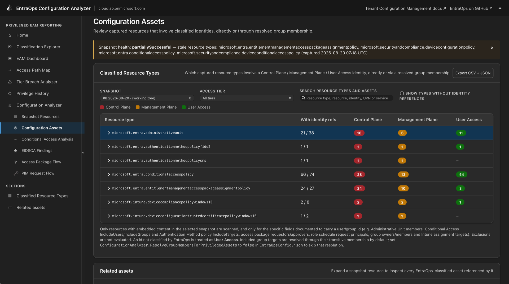

The Snapshot Resource Explorer exposes the captured resource hierarchy and its property details
without requiring direct inspection of the underlying JSON files.

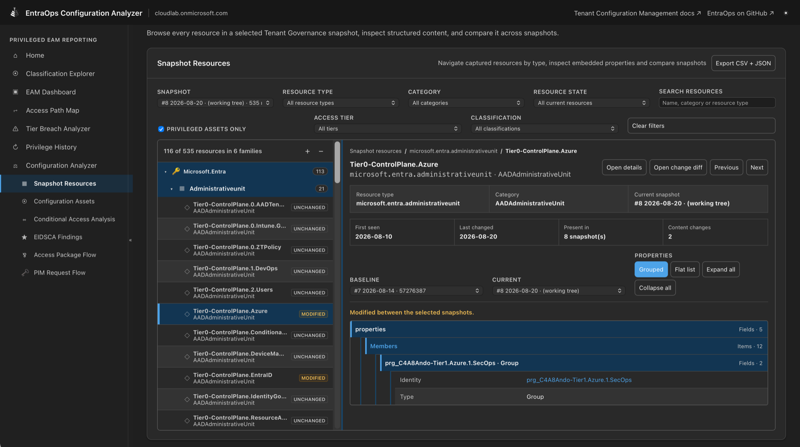

The reporting workflow accepts partially successful UTCM snapshots by default. Resource types whose
backing workload failed during the capture retain their last known data and are marked stale in the
manifest; types with per-resource export errors are published with the resources that did export
and keep the previous file of every resource the job did not return (`PublishedWithErrors`). Set
`ConfigurationAnalyzer.AllowPartialTenantGovernanceSnapshot: false` when the report must use only
a complete point-in-time snapshot. Every report that consumes Configuration Analyzer data displays
a permanent partial-snapshot warning with the capture time and the source snapshot for each stale
resource type, the retained-resource count of each type published with errors, plus the sanitized
capture diagnostics and remediation hints retained in the
manifest. Structural duplication or a manifest/file-count mismatch blocks report publication.

Generate or refresh the dataset with `New-EntraOpsTenantGovernanceConfigurationAnalyzerData` (or
as part of `New-EntraOpsReportingData`). The app requires the Tenant Governance Snapshot feature
to be enabled and at least one snapshot committed to the repository - see
[Tenant Governance](../tenant-governance/index.html#tenant-governance-snapshots).

### Configuration Analyzer companion reports

Four focused reports are available from the Configuration Analyzer tile in the reporting portal:

- [**Conditional Access Analysis**](../../Reports/ConditionalAccessAnalysis/README.md) presents the policy-flow Sankey, filters, and coverage-gap checks
  as a dedicated view.
- [**EIDSCA Findings**](../../Reports/EidscaCoverage/README.md) presents the supported Entra ID Security Config Analyzer recommendations
  from the same snapshot data.
- [**PIM Request Flow**](../../Reports/PimRequestFlow/README.md) visualizes PIM role settings and approval paths from the captured tenant
  configuration.
- [**Access Package Flow**](../../Reports/AccessPackageFlow/README.md) visualizes entitlement-management access-package policies, requestors,
  approvers, and resource targets. Its baseline view uses the snapshot dataset. Run
  `New-EntraOpsAccessPackageFlowData` (or leave Access Package Flow enabled in
  `New-EntraOpsReportingData`) to add live Microsoft Graph enrichment for current assignments,
  resource-role scopes, and group tier/member details.

The Conditional Access overview combines policy coverage findings with filters and summary counts;
the flow view then traces assignments through conditions and grant controls.

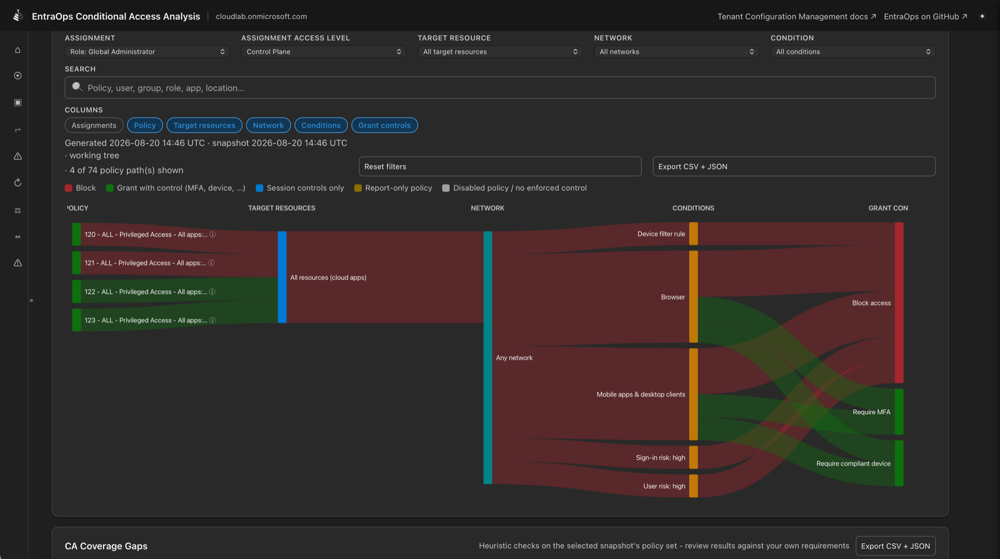

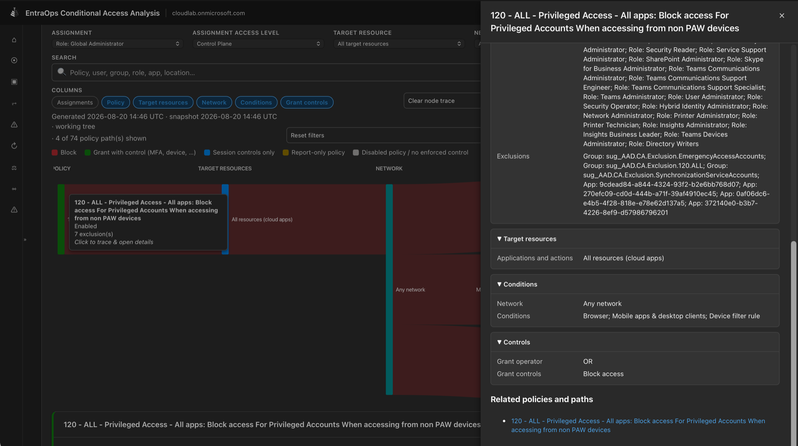

EIDSCA Findings groups the supported checks by result and control area so failed or informational
findings can be reviewed with their captured evidence.

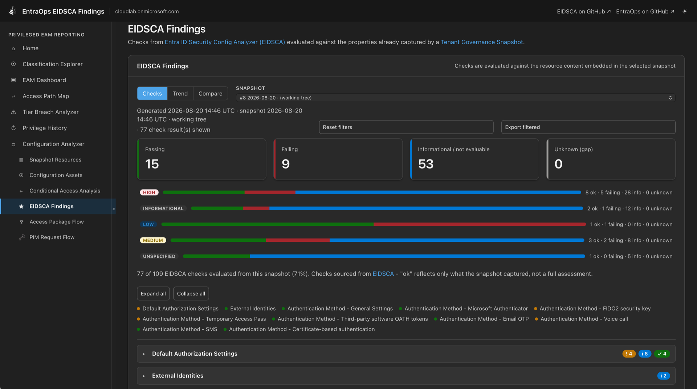

PIM Request Flow makes activation and assignment requirements visible from role through approval
and notification, while Access Package Flow traces requestors through policies to resource roles.

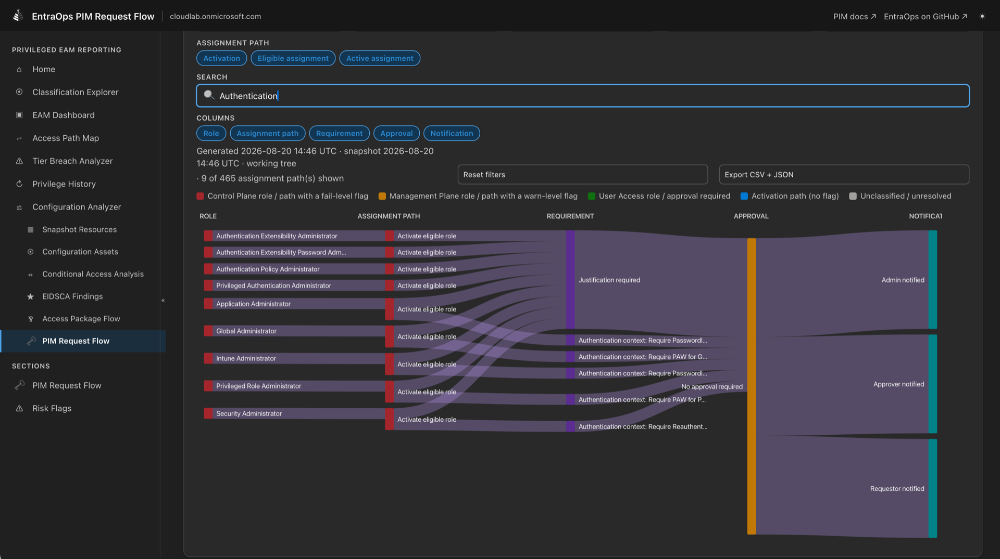

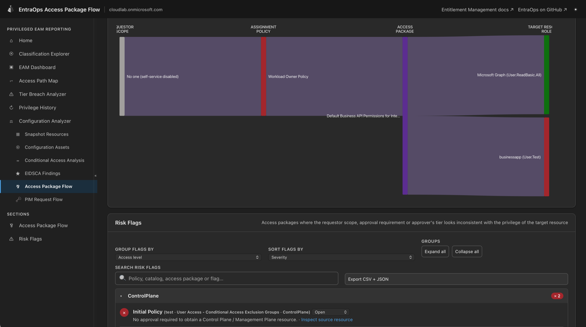

Conditional Access Analysis, EIDSCA Findings, and PIM Request Flow share the Configuration
Analyzer dataset. All four companion reports therefore require Tenant Governance snapshots; only
the optional Access Package Flow enrichment requires an active Microsoft Graph connection.

### Analyst workflow

The four companion reports show the dataset generation time and selected snapshot, a live count of
the currently filtered results, and **Reset filters** / **Export filtered** controls. Export creates
both CSV and JSON files locally; it never uploads tenant data. Finding rows support browser-local
review statuses (`New`, `Accepted risk`, and `Remediated`) so analysts can triage a report without
changing its source snapshots or configured exclusions. PIM Request Flow and Access Package Flow
also link each concrete finding to its captured source resource in Configuration Analyzer.

When a flow node represents a resolved Entra object, Access Package Flow and Conditional Access
Analysis open the shared object-details panel. These selections are bookmarkable as
`#object=<object-id>` and restore the panel when the URL is opened. The panel combines available
Privileged EAM classification, role assignments, group relationships, API permissions, and related
flow context. Configuration resources continue to use Configuration Analyzer's
`#resource=<snapshot>|<path>` link; aggregate coverage checks deliberately remain evidence lists
rather than being presented as a link to one arbitrary object. EIDSCA Findings provides an
**Inspect source resource** action for each evaluated, resource-backed check; it opens the same
panel with the captured resource, evaluated value, and recommendation.

## GitHub Copilot Agents

EntraOps ships two GitHub Copilot custom agents (`.github/agents/`) that analyze your
`PrivilegedEAM` export directly in chat, applying the same Enterprise Access Model tiers and
hygiene rules used throughout EntraOps. Pick either agent from the Copilot Chat agent picker in
VS Code or on github.com.

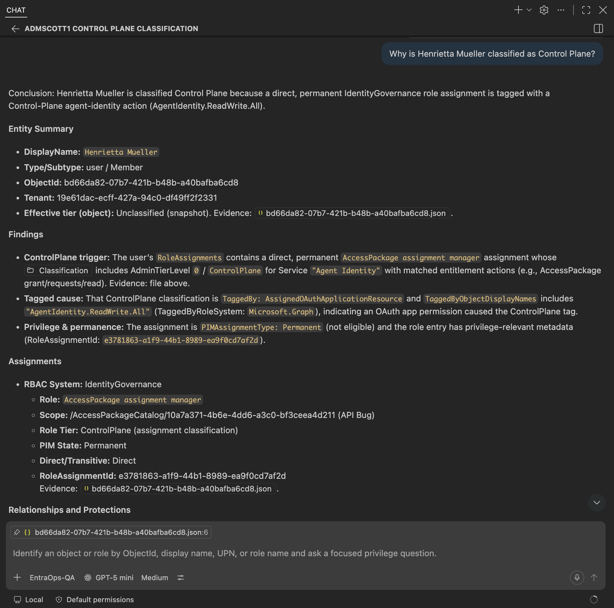

### EntraOps-Report

Generates a comprehensive markdown report (`Overview.md`) from the full `PrivilegedEAM` export:
access-level mismatches (role tier higher than the member's own tier), permanent privileges on
Control/Management Plane roles, on-premises-synced or guest accounts holding privileged roles,
privileged objects owned by lower-tier identities, and simplified attack paths (transitive access,
cross-RBAC-system lateral movement). When available, it also queries Microsoft Sentinel for
`UserRiskEvents`/`ServicePrincipalRiskEvents` and recent `SecurityIncident` data for any privileged
objects found.

### EntraOps-QA

Answers focused, chat-based questions about a single identity, group, service principal or role -
without scanning the whole export. It locates only the relevant JSON file(s) for the requested
entity, then reports its role/tier assignments (including PIM eligible vs. permanent), hygiene
flags (on-premises/guest, ownership), and a simplified attack path explanation, optionally enriched
with Microsoft Sentinel risk/incident data.

Both agents read `EntraOpsConfig.json` to identify the tenant and configured RBAC systems, and
expect the `PrivilegedEAM` export folder to already exist (see
[Collecting and exporting data](../privileged-eam/index.html#collecting-and-exporting-data) or
[Try it with zero configuration](../get-started/index.html#try-it-with-zero-configuration)).

## Microsoft Sentinel integration

### Parser for Custom Tables and WatchLists

A parser ensures a standardized schema for EntraOps data across the various ingestion options.
This allows you to use the same queries and workbooks, regardless of whether you have used
WatchLists or a Custom Table.

Deploy the parser matching your ingestion option (choose the Custom Table parser if you have
enabled ingestion to both targets):

- [Deploy the Custom Table parser to Azure](https://portal.azure.com/#create/Microsoft.Template/uri/https%3A%2F%2Fraw.githubusercontent.com%2FCloud-Architekt%2FEntraOps%2Fmain%2FParsers%2FPrivilegedEAM_CustomTable.json)
- [Deploy the WatchLists parser to Azure](https://portal.azure.com/#create/Microsoft.Template/uri/https%3A%2F%2Fraw.githubusercontent.com%2FCloud-Architekt%2FEntraOps%2Fmain%2FParsers%2FPrivilegedEAM_WatchLists.json)

### Ingest classification and enrichment data

- `Save-EntraOpsPrivilegedEAMInsightsCustomTable` ingests classified Privileged EAM data into a Log Analytics/Sentinel custom table (`IngestToLogAnalytics` in `EntraOpsConfig.json`).
- `Save-EntraOpsPrivilegedEAMWatchLists` ingests the same data as Sentinel WatchLists (`IngestToWatchLists`/`WatchListTemplates`), and can also generate the workload-identity enrichment WatchLists described below via `-WatchListWorkloadIdentity`.
- `Save-EntraOpsPrivilegedEAMEnrichmentToWatchLists` generates the "VIP Users", "High Value Assets" and "Identity Correlation" WatchLists (`-WatchListTemplates`) that correlate privileged and regular work accounts using the custom security attributes described in [Core &rarr; Classify by Custom Security Attributes](../core/index.html#classify-by-custom-security-attributes).

> **`RbacSystems` default.** Both cmdlets default `-RbacSystems` to `Azure`, `EntraID`,
> `IdentityGovernance`, `DeviceManagement`, `ResourceApps` - the five systems generated by the
> standard EntraOps configuration. `AzureBilling` and `Defender` are **not** included by default;
> pass them explicitly via `-RbacSystems` if you need their WatchLists. The generated
> `EntraOpsConfig.json`'s `SentinelWatchLists` section does not set `RbacSystems`, so
> `Push-EntraOpsPrivilegedEAM` relies on this default - if you need `AzureBilling`/`Defender`
> WatchLists, add an explicit `RbacSystems` array (including the systems you already rely on) to
> the `SentinelWatchLists` section of your `EntraOpsConfig.json`.

### Examples: EntraOps data in the Unified SecOps Platform (Sentinel and XDR)

**Devices in Exposure Management with authentication from Control Plane users:**

```kusto
let ClassifiedTier0User = PrivilegedEAM
                | where Classification contains "ControlPlane"
                | where ObjectType == "user"
                | summarize arg_max(TimeGenerated, *) by ObjectId
                | project tostring(ObjectId), tostring(ObjectAdminTierLevel);
let Tier0Nodes = ExposureGraphNodes
                | where NodeLabel == "user"
                | mv-expand parse_json(EntityIds)
                | where parse_json(EntityIds).type == "AadObjectId"
                | extend NodeId = tostring(NodeId)
                | extend AadObjectId = tostring(parse_json(EntityIds).id)
                | extend TenantId = extract("tenantid=([\\w-]+)", 1, AadObjectId)
                | extend ObjectId = tostring(extract("objectid=([\\w-]+)", 1, AadObjectId))
                | where ObjectId in (ClassifiedTier0User);
let SensitiveRelation = dynamic(["can authenticate as","has credentials of","can authenticate as", "frequently logged in by"]);                
ExposureGraphEdges
| where TargetNodeId in (Tier0Nodes) and EdgeLabel in (SensitiveRelation)
| where SourceNodeLabel == "device"
// Get details of devices
| join kind = inner ( ExposureGraphNodes ) on $left.SourceNodeId == $right.NodeId
// Get ObjectId of Target (Tier0) Nodes
| join kind = inner ( Tier0Nodes ) on $left.TargetNodeId == $right.NodeId
| mv-expand parse_json(NodeProperties)
| summarize make_list(EdgeLabel) by SourceNodeName, SourceNodeLabel, tostring(SourceNodeCategories), TargetNodeId, TargetNodeName, TargetNodeLabel, tostring(TargetNodeCategories),
    VulnerableToPrivilegeEscalation = tostring(parse_json(tostring(parse_json(tostring(NodeProperties.rawData)).highRiskVulnerabilityInsights)).vulnerableToPrivilegeEscalation),
    MdeExpsoureScore = tostring(parse_json(NodeProperties).rawData.exposureScore),
    MdeRiskScore = tostring(parse_json(NodeProperties).rawData.riskScore),
    MdeSensorHealth = tostring(parse_json(NodeProperties).rawData.sensorHealthState),
    MdeMachineGroup = tostring(parse_json(NodeProperties).rawData.machineGroup)
```

**Resources with access or authentication to classified privileges in EntraOps:**

```kusto
let SensitiveRelation = dynamic(["can authenticate as","has credentials of","affecting", "can authenticate as", "frequently logged in by"]);
let ClassifiedTier0Assets = PrivilegedEAM
                | summarize arg_max(TimeGenerated, *) by tostring(ObjectId);
let Tier0Nodes = ExposureGraphNodes
                | mv-expand parse_json(EntityIds)
                | where parse_json(EntityIds).type == "AadObjectId"
                | extend NodeId = tostring(NodeId)
                | extend AadObjectId = tostring(parse_json(EntityIds).id)
                | extend TenantId = extract("tenantid=([\\w-]+)", 1, AadObjectId)
                | extend ObjectId = extract("objectid=([\\w-]+)", 1, AadObjectId)
                | where ObjectId in (ClassifiedTier0Assets);
let ExposedEdges = ExposureGraphEdges
            | where EdgeLabel in (SensitiveRelation)
            | extend TargetNodeId = tostring(TargetNodeId)
            | join kind=inner ( Tier0Nodes ) on $left.TargetNodeId == $right.NodeId;
ClassifiedTier0Assets
| join kind=inner ( ExposedEdges ) on ObjectId
| project Type2, SourceNodeName, SourceNodeLabel, SourceNodeCategories, EdgeLabel, TargetNodeId, TargetNodeLabel, TargetNodeCategories, Classification, RoleAssignments, Categories
```

### Workbooks for visualizing EntraOps classification data

These workbooks visualize users, workload identities, groups and their classified role
assignments. Pre-requisite: EntraOps data has been ingested to a WatchList or Custom Table and the
associated parser has been deployed.

- [Deploy "EntraOps Privileged EAM - Overview"](https://portal.azure.com/#create/Microsoft.Template/uri/https%3A%2F%2Fraw.githubusercontent.com%2FCloud-Architekt%2FEntraOps%2Fmain%2FWorkbooks%2FEntraOps%20Privileged%20EAM%20-%20Overview.json)
- [Deploy "EntraOps Privileged EAM - Agent Identities"](https://portal.azure.com/#create/Microsoft.Template/uri/https%3A%2F%2Fraw.githubusercontent.com%2FCloud-Architekt%2FEntraOps%2Fmain%2FWorkbooks%2FEntraOps%20Privileged%20EAM%20-%20Agent%20Identities.json)
- [Deploy "EntraOps Privileged EAM - Workload Identities"](https://portal.azure.com/#create/Microsoft.Template/uri/https%3A%2F%2Fraw.githubusercontent.com%2FCloud-Architekt%2FEntraOps%2Fmain%2FWorkbooks%2FEntraOps%20Privileged%20EAM%20-%20Workload%20Identities.json)

### Workload Identity enrichment

The "EntraOps Privileged EAM - Workload Identities" workbook is powered by four dedicated
WatchLists, refreshed together by `Save-EntraOpsWorkloadIdentityEnrichmentWatchLists` (requires the
[SentinelEnrichment](https://www.powershellgallery.com/packages/SentinelEnrichment) module and a
Sentinel workspace) or individually via its `-WatchLists` parameter:

| WatchList                           | Cmdlet                                        | Data                                                                                                                             |
| ----------------------------------- | --------------------------------------------- | -------------------------------------------------------------------------------------------------------------------------------- |
| `ManagedIdentityAssignedResourceId` | `Get-EntraOpsManagedIdentityAssignments`      | System- and user-assigned managed identities mapped to the Azure resource(s) that consume them (via Azure Resource Graph).       |
| `WorkloadIdentityAttackPaths`       | `Get-EntraOpsWorkloadIdentityAttackPaths`     | Attack paths from Microsoft Defender for Cloud CSPM involving a service principal or managed identity entity.                    |
| `WorkloadIdentityInfo`              | `Get-EntraOpsWorkloadIdentityInfo`            | Service principal/application metadata, enriched with the `privilegedWorkloadIdentity` custom security attribute classification. |
| `WorkloadIdentityRecommendations`   | `Get-EntraOpsWorkloadIdentityRecommendations` | Microsoft Entra recommendations impacting applications, filtered by `-StatusFilter`.                                             |

`Save-EntraOpsWorkloadIdentityInfo` is a self-contained variant of `Get-EntraOpsWorkloadIdentityInfo`
that authenticates with a system-assigned managed identity (e.g. for a scheduled Azure Automation
runbook) and pushes directly to the `WorkloadIdentityInfo` WatchList.

## BloodHound integration

EntraOps can export its Privileged EAM classification data as a [BloodHound OpenGraph](https://bloodhound.specterops.io/opengraph/overview)
JSON payload, enriching an existing AzureHound-ingested tenant graph with EntraOps node types and
tier classifications. This makes Enterprise Access Model tier-boundary violations - including
cloud-managed PAW paths - demoable as attack paths directly in BloodHound CE or Enterprise.

The exporter is modeled as an AzureHound enrichment layer. It reuses AzureHound-compatible node
and edge kinds for principals, devices, service principals, groups, and Entra ID role definitions,
while adding `EO_`-prefixed kinds for EntraOps-owned context: concrete role assignments, assignment
scope, classification evidence, PAW relationships, sponsor links, identity parent links, and Intune
device permissions.

**Key cmdlets:**

- `Export-EntraOpsPrivilegedEAMBloodHound` - converts per-RBAC-system EAM export files (produced by `Save-EntraOpsPrivilegedEAMJson`) into a BloodHound-compatible OpenGraph JSON file, ready for upload alongside the custom extension schema.
- `Save-EntraOpsPrivilegedEAMJson` / `Update-EntraOpsClassificationControlPlaneScope` - must run first to generate classified EAM JSON. The scope update step also writes `DeviceManagement_ScopeGroupDeviceMembers.json`, which the exporter uses to build traversable `EO_IntuneRolePermission` edges from Intune role assignments to concrete `AZDevice` nodes.

**Graph model highlights:**

- Entra ID, Intune, Identity Governance, Defender, and App Role assignments are all represented as first-class `EO_*RoleAssignment` nodes, preserving scope, PIM state, and classification evidence without replacing native AzureHound paths.
- For DeviceManagement, `EO_IntuneRolePermission` edges connect role assignments and their principals to scoped `AZDevice` nodes when matched Intune actions indicate device-impacting capability, making PAW tier-boundary paths visible and traversable.
- Classification decisions are linked via `EO_ClassifiedViaObject` edges, showing exactly which object drove an Enterprise Access Model tier assignment.

For detailed setup steps, schema documentation, Cypher query examples, and privilege zone rules,
see the [BloodHound Integration README](https://github.com/Cloud-Architekt/EntraOps/tree/main/Integrations/BloodHound).
