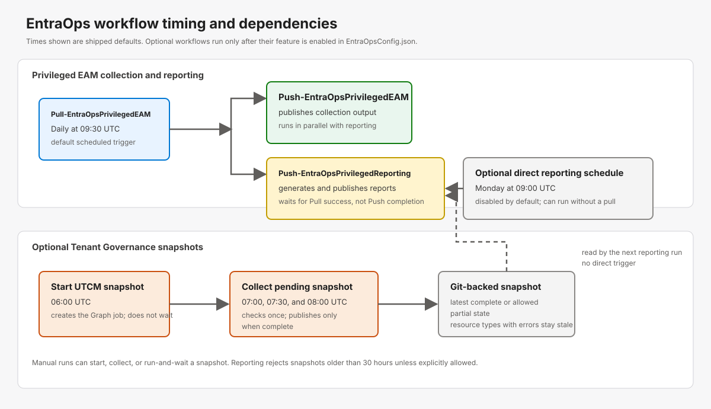

# Tenant Governance

Tenant Governance is an **optional feature area** in EntraOps. It is disabled by default
and is independent of normal Privileged EAM collection: enable only the capabilities your tenant
needs. It combines two related capabilities:

- **Cross-tenant privileged access**: collect and classify delegated administration relationships
  between a governing tenant and its governed tenants.
- **Configuration snapshots**: capture selected Microsoft Entra, Intune, and Security & Compliance
  configuration through Microsoft Graph Tenant Configuration Management (UTCM), commit the result
  as JSON, and analyze changes over time.

> [!WARNING]
> Microsoft Graph documents Tenant Configuration Management under the v1.0 API, while individual
> Tenant Governance relationships or supported resource types can still change independently.
> Validate permissions, quotas, and captured resource coverage in a non-production tenant before
> relying on snapshots for operational controls.

## Learn the platform

If Tenant Governance or UTCM is new to you, start with these Microsoft Learn resources before
enabling the feature:

- [Tenant Governance in Microsoft Entra](https://learn.microsoft.com/entra/id-governance/tenant-governance/overview)
- [Microsoft Graph UTCM Entra resources](https://learn.microsoft.com/en-us/graph/utcm-entra-resources)
- [Microsoft Graph beta reference](https://learn.microsoft.com/en-us/graph/api/overview?view=graph-rest-beta)

## Enable the feature

Create or update `EntraOpsConfig.json` with `New-EntraOpsConfigFile`. The snapshot capability is
opt-in through `TenantGovernanceSnapshot.EnableTenantGovernanceSnapshot`, which defaults to
`false`:

```powershell
New-EntraOpsConfigFile -TenantName "contoso.onmicrosoft.com" -EnableTenantGovernanceSnapshot $true
```

The [Configuration Wizard](../configuration/index.html) can also create or import this section.
After changing the configuration, apply its schedules to your automation platform:

- GitHub: run `Update-EntraOpsRequiredWorkflowParameters`.
- Azure DevOps: run `Update-EntraOpsAzureDevOpsSchedules`.

### Cross-tenant delegated administration

To classify privileged access across a Tenant Governance relationship, configure the governing
tenant in `EntraOpsConfig.json`:

```json
{
  "ManagingTenantId": "<governing-tenant-id>",
  "ManagingTenantName": "<governing-tenant-name>.onmicrosoft.com"
}
```

EntraOps enumerates governance relationships and resolves principals from governed tenants. Every
resolved principal retains its source tenant in `ObjectTenantId`, so downstream Privileged EAM
queries and reports can distinguish home-tenant and foreign identities.

Use a multi-tenant workload identity for this scenario. Consent it in the governed tenants, grant
the required Microsoft Graph application permissions in the governing tenant, and avoid relying on
an interactive single-tenant session for scheduled collection.

## Tenant Governance snapshots

Snapshots capture a selected set of tenant configuration resources, such as Conditional Access
policies, authentication methods, authentication strengths, cross-tenant access settings, named
locations, PIM role settings, and Intune compliance policies. Every captured resource is written
under:

```
TenantGovernance/Snapshots/<resource-type>/<display-name-category>/<name>.json
```

Files represent the latest state. Git history provides the timeline, rather than storing a separate
copy of every snapshot locally. `SnapshotResourceFileNaming` can use a readable display name or a
stable resource ID so renamed resources remain in the same Git path.

Every path segment is normalized before it is written, so a snapshot stays portable across the
platform that collects it and the platforms that check it out. Characters that are invalid in a file
name on any supported platform (`< > : " / \ | ? *`, control characters), PowerShell wildcard
characters (`[`, `]`), trailing dots and whitespace, and Windows reserved device names are replaced
or escaped, Unicode is normalized to form C, and oversized names are truncated with a content hash.
A resource named `Admin 4: Require phishing-resistant MFA` is therefore stored as
`Admin 4_ Require phishing-resistant MFA.json`. File names are allocated in a deterministic order
and checked for uniqueness across the whole snapshot; resources that resolve to the same name each
receive a suffix derived from their resource ID (independent of the order Graph returned them in and
of their content) and a warning is emitted. `SnapshotResourceFileNaming = ResourceId` avoids the
situation entirely.

The configuration-driven orchestration is available outside GitHub Actions as an exported module
command. The surrounding CI platform only needs to establish its workload identity and publish the
resulting files:

```powershell
Import-Module ./EntraOps -Force
Invoke-EntraOpsTenantGovernanceSnapshot -ConfigFilePath ./EntraOpsConfig.json `
  -AuthenticationType AlreadyAuthenticated -Operation RunAndWait
```

The command loads the configured resources and naming policy, executes the Start/Collect/RunAndWait
state machine, reports partial captures, validates the published snapshot, and closes a connection it
opened. Use `-SkipConnect` when the calling process already established an EntraOps connection.

Canonical identity is validated independently of file names. If Graph returns the same
`resourceType` and immutable resource ID twice, publication stops before any resource-type folder is
promoted. The generated-artifact validator also rejects duplicate canonical identities already on
disk and verifies manifest file counts before workflows commit or publish reports.

The content of every resource file is normalized as well: property names are sorted alphabetically
at every nesting level. Array order is retained because it can carry configuration meaning, such as
the order of approval stages. Only known set-like collections whose Graph order is unstable are
sorted, registered per resource type: Administrative Unit `Members` and `ScopedRoleMembers`, group
`Members`, and the authorization policy's `PermissionGrantPolicyIdsAssignedToDefaultUserRole`. This
prevents unchanged configuration from producing reorder-only diffs without changing positional
configuration data. The snapshot manifest is normalized the same way: `AttemptResourceTypeCounts`
and `StaleResourceTypes` are written in ordinal order instead of the order Graph returned resources
and errors in.

A `partiallySuccessful` job is published per resource type. Types without Graph errors are published
from the new capture. A type whose only errors are per-resource export failures (for example
`Request_ResourceNotFound` for one access package assignment policy that references a deleted object)
still returns every resource that did export: those are published, and the previously published file
of each resource the job did not return is retained, matched by resource identity so a renamed
resource is not kept twice. The manifest marks such types `PublishedWithErrors` with their
`RetainedResourceCount` and lists them in `PublishedWithErrorsResourceTypes`; the capture
diagnostics stay attached. A retained file is therefore last-known state, not evidence that the
resource still exists - review the diagnostics and fix the referenced object in the tenant. Types
whose backing workload could not be reached (`ConnectionError`) or that returned no resource at all
keep their previous files and are marked `PreservedStale`. Both states keep `IsComplete` at `false`.

### Configuration

`TenantGovernanceSnapshot` controls the feature:

| Setting                               | Purpose                                                                                                                |
| ------------------------------------- | ---------------------------------------------------------------------------------------------------------------------- |
| `EnableTenantGovernanceSnapshot`      | Master switch; disabled by default.                                                                                    |
| `ResourcesToInclude`                  | Microsoft Entra resource types to capture. High-cardinality directory objects are supported but excluded by default.   |
| `SnapshotDisplayNamePrefix`           | Cosmetic UTCM snapshot name prefix.                                                                                    |
| `SnapshotResourceFileNaming`          | `ResourceId` (new-config default) for stable paths across renames, or `DisplayName` for readable paths.                |
| `SnapshotScheduledTrigger`            | Enables or disables every scheduled snapshot run. Disabled by default and ignored while the master switch is disabled. |
| `SnapshotScheduledCron`               | Starts the UTCM snapshot job without waiting. Default: `0 6 * * *` (06:00 UTC daily).                                  |
| `SnapshotScheduledCronComplete`       | First one-shot collection attempt. Default: `0 7 * * *` (07:00 UTC daily).                                             |
| `SnapshotScheduledCronCompleteRetry1` | First collection retry for jobs still running at the first attempt. Default: `30 7 * * *` (07:30 UTC daily).           |
| `SnapshotScheduledCronCompleteRetry2` | Final collection retry for jobs still running at the earlier attempts. Default: `0 8 * * *` (08:00 UTC daily).         |

UTCM enforces service limits on the number of extracted resources per tenant and keeps snapshots
server-side only for a limited period, and only a limited number of snapshot jobs stays visible at
once. The exact figures are set by the service and change independently of EntraOps, so check the
current [Microsoft Graph UTCM API limits](https://learn.microsoft.com/en-us/graph/api/resources/unified-tenant-configuration-management-api-overview?view=graph-rest-1.0#api-limits)
before rollout and keep large or high-cardinality resource sets on an appropriate cadence.

### Permissions and prerequisites

The snapshot workflow validates its prerequisites before collection. It requires
`ConfigurationMonitoring.ReadWrite.All` to create snapshots and read permissions on the first-party
**Microsoft Tenant Configuration Management** service principal for every selected resource type.
`New-EntraOpsWorkloadIdentity` configures these permissions when the feature is enabled. Use
`Register-EntraOpsTenantGovernanceServicePrincipal` to repair or extend an existing workload
identity, and `Test-EntraOpsTenantGovernancePrerequisite` to diagnose missing permissions.

#### First-time setup

Complete this setup before enabling the scheduled workflow. The setup account must be able to
create service principals and grant Microsoft Graph application permissions. Use a **Global
Administrator** for the initial run: some resource types require application permissions that
cannot be admin-consented by an Application Administrator, Cloud Application Administrator, or
Privileged Role Administrator alone.

1. Enable snapshots and choose the resource types to capture only if they are not already defined
  in `EntraOpsConfig.json`. Keep the configured resource set deliberate: EntraOps grants only the
  permissions required by `ResourcesToInclude`. If the existing configuration already has
  `TenantGovernanceSnapshot.EnableTenantGovernanceSnapshot` set to `true` and defines
  `ResourcesToInclude`, continue with step 2.

  ```powershell
  New-EntraOpsConfigFile -TenantName "contoso.onmicrosoft.com" -EnableTenantGovernanceSnapshot $true
  ```

2. Create or update the EntraOps workload identity. For a new identity, this grants
  `ConfigurationMonitoring.ReadWrite.All` to the EntraOps workload identity and creates or
  configures the first-party **Microsoft Tenant Configuration Management** (UTCM) service
  principal with the required permissions for the configured resource types.

  ```powershell
  Import-Module ./EntraOps -Force
  New-EntraOpsWorkloadIdentity -AppDisplayName "EntraOps-Contoso" `
    -ConfigFile "./EntraOpsConfig.json" `
    -CreateFederatedCredential `
    -GitHubOrg "contoso" -GitHubRepo "EntraOps-Contoso" `
    -FederatedEntityType "Branch" -FederatedEntityName "main"
  ```

3. Validate the result before scheduling a snapshot. Run this while connected as the EntraOps
  workload identity or another identity that has `ConfigurationMonitoring.ReadWrite.All` and can
  read service-principal app-role assignments.

  ```powershell
  Test-EntraOpsTenantGovernancePrerequisite -ThrowOnFailure
  ```

4. Apply the updated settings to your automation platform, then run the Tenant Governance workflow
  or pipeline manually once to verify end-to-end collection.

  ```powershell
  # GitHub Actions
  Update-EntraOpsRequiredWorkflowParameters

  # Azure DevOps
  Update-EntraOpsAzureDevOpsSchedules
  ```

### Run a snapshot interactively

Use `Save-EntraOpsTenantGovernanceSnapshotJson` when you want JSON files on disk;
`Get-EntraOpsTenantGovernanceSnapshot` returns captured resources as PowerShell objects but does
not write them. If you did not complete the workload-identity setup above, a Global Administrator
must first run `Register-EntraOpsTenantGovernanceServicePrincipal` once to configure the UTCM
service principal for the resource types in `EntraOpsConfig.json`.

| `-Operation` value     | Behavior                                                                                                                      |
| ---------------------- | ----------------------------------------------------------------------------------------------------------------------------- |
| `RunAndWait` (default) | Creates a job and waits up to `TimeoutInSeconds`. The default timeout is `900` seconds (15 minutes).                          |
| `Start`                | Creates a job, saves its Id, and returns immediately. It does not write snapshot resource files yet.                          |
| `Collect`              | Checks the saved pending job once. If complete, it downloads and writes the JSON files; otherwise, run `Collect` again later. |

For each interactive run, connect Azure PowerShell and explicitly consent the delegated
`ConfigurationMonitoring.ReadWrite.All` scope before connecting EntraOps:

```powershell
Import-Module ./EntraOps -Force
Connect-AzAccount -Tenant "<tenant-id>"
Connect-MgGraph -TenantId "<tenant-id>" -Scopes "ConfigurationMonitoring.ReadWrite.All"
Connect-EntraOps -AuthenticationType "AlreadyAuthenticated" -TenantName "contoso.onmicrosoft.com"
Save-EntraOpsTenantGovernanceSnapshotJson
```

To allow more than the default 15 minutes, set the timeout explicitly:

```powershell
Save-EntraOpsTenantGovernanceSnapshotJson -Operation RunAndWait -TimeoutInSeconds 1800
```

If the timeout expires, the local wait does not cancel the Graph job and EntraOps saves its Id in
`TenantGovernance/Snapshots/.PendingSnapshotJob.json`. No snapshot resource files are written until
the job completes. If polling failed, the pending state also records the latest polling error instead
of claiming that the job is still running. Check and publish the job later with:

```powershell
Save-EntraOpsTenantGovernanceSnapshotJson -Operation Collect
```

For long-running snapshots, you can intentionally split the process into two commands:

```powershell
Save-EntraOpsTenantGovernanceSnapshotJson -Operation Start
# Run this later; repeat it if the job is still pending.
Save-EntraOpsTenantGovernanceSnapshotJson -Operation Collect
```

`RunAndWait` and `Start` refuse to create another job while a pending job exists. Run `Collect` to
finish that job before starting a new snapshot.

#### Repair an existing setup

The error stating that the UTCM service principal is missing read permissions means the
first-party service principal exists but does not have the permissions implied by the current
`ResourcesToInclude` list. Connect as a Global Administrator and run the following idempotent
repair command from the repository root:

```powershell
Import-Module ./EntraOps -Force
Register-EntraOpsTenantGovernanceServicePrincipal -GrantConfigurationMonitoringReadWrite
```

The command creates the UTCM service principal when absent, adds only missing application
permissions, and also repairs the EntraOps workload identity's
`ConfigurationMonitoring.ReadWrite.All` grant. It derives the exact permission set from
`TenantGovernanceSnapshot.ResourcesToInclude` in `EntraOpsConfig.json`; do not manually grant the
19 permissions listed by a failed workflow run.

Re-run the command whenever `ResourcesToInclude` changes, then validate it:

```powershell
Test-EntraOpsTenantGovernancePrerequisite -ThrowOnFailure
```

If the registration command reports failed assignments, sign in as a Global Administrator and
run it again. Some selected Security & Compliance resources require `Exchange.ManageAsApp`; the
cmdlet explicitly asks for confirmation before granting this non-read permission. Remove the
corresponding resource type from `ResourcesToInclude` if that grant is not acceptable for the
tenant.

## Automation workflow

The optional [Pull-EntraOpsTenantGovernance workflow](../../.github/workflows/Pull-EntraOpsTenantGovernance.yaml)
uses GitHub OIDC and has three operations:

### Workflow timing and dependencies



The default Privileged EAM pull runs daily at 09:30 UTC. After it succeeds, the push and reporting
workflows start independently: reporting waits for the successful pull, but does not wait for the
push workflow. A separate reporting schedule is disabled by default; when enabled it runs every
Monday at 09:00 UTC and does not require a preceding pull.

Tenant Governance snapshots are disabled by default. When enabled, the supplied workflow starts a
UTCM job at 06:00 UTC and checks it at 07:00, 07:30, and 08:00 UTC. Collection never blocks while a
Graph job is running, and a completed snapshot does not directly trigger reporting. The next
reporting run reads the latest accepted snapshot; it requires a snapshot no older than 30 hours by
default and can be configured to accept a partial snapshot with explicitly stale resource types.

- **Start schedule**: creates a UTCM snapshot job and persists its id without polling.
- **Collect schedules**: check the pending job once and publish it only after completion. The
  default configuration includes three collection attempts, so longer UTCM captures can complete
  without keeping a GitHub Actions job polling.
- **Manual dispatch**: choose Start, Collect, or Run and wait. Run and wait uses a configurable
  timeout for an interactive capture.

The workflow writes a manifest for each attempt, preserves resource types that Graph reports as
failed during a partial capture, and runs a summary that warns when configured resource types have
no captured data. Sanitized diagnostics are retained per failed resource type: category, Graph error
code when available, occurrence count, normalized message, and a remediation hint. Full raw Graph
messages and tokens are not written to the repository. The protected workflow output remains the
place to inspect details that cannot be safely persisted. These persisted diagnostics are also
returned by the snapshot report and shown in the permanent partial-snapshot banner in reporting apps.

## Scripts and cmdlets

| Script or cmdlet                                                                                                                                      | Role                                                                         |
| ----------------------------------------------------------------------------------------------------------------------------------------------------- | ---------------------------------------------------------------------------- |
| [`Get-EntraOpsTenantGovernanceSnapshot`](../../EntraOps/Public/TenantGovernance/Get-EntraOpsTenantGovernanceSnapshot.ps1)                             | Creates a UTCM job, waits for completion, and returns captured resources.    |
| [`Save-EntraOpsTenantGovernanceSnapshotJson`](../../EntraOps/Public/TenantGovernance/Save-EntraOpsTenantGovernanceSnapshotJson.ps1)                   | Persists completed resources as deterministic JSON and resumes pending jobs. |
| [`Test-EntraOpsTenantGovernancePrerequisite`](../../EntraOps/Public/TenantGovernance/Test-EntraOpsTenantGovernancePrerequisite.ps1)                   | Validates Graph and UTCM service-principal permissions.                      |
| [`Register-EntraOpsTenantGovernanceServicePrincipal`](../../EntraOps/Public/Configuration/Register-EntraOpsTenantGovernanceServicePrincipal.ps1)      | Provisions or repairs the UTCM service principal and permissions.            |
| [`Get-EntraOpsTenantGovernanceSnapshotReport`](../../EntraOps/Public/TenantGovernance/Get-EntraOpsTenantGovernanceSnapshotReport.ps1)                 | Summarizes captured resource coverage and missing or empty resource types.   |
| [`New-EntraOpsTenantGovernanceConfigurationAnalyzerData`](../../EntraOps/Public/Reportings/New-EntraOpsTenantGovernanceConfigurationAnalyzerData.ps1) | Builds Configuration Analyzer data from snapshot Git history.                |

## Analyze snapshot history

The [Configuration Analyzer](../reportings/index.html#configuration-analyzer) turns the Git history
of `TenantGovernance/Snapshots` into a change timeline and point-in-time comparison. Generate its
data after a snapshot has been committed:

```powershell
Import-Module ./EntraOps -Force
New-EntraOpsTenantGovernanceConfigurationAnalyzerData
```

Use it to compare a baseline and current snapshot, then inspect property-level diffs during a
deployment, incident, or change window. See [Reportings &rarr; Configuration Analyzer](../reportings/index.html#configuration-analyzer)
for its Configuration Assets, Conditional Access, EIDSCA, PIM, and access-package analysis views;
see the [Configuration Analyzer README](../../Reports/ConfigurationAnalyzer/README.md) for
generation options.
