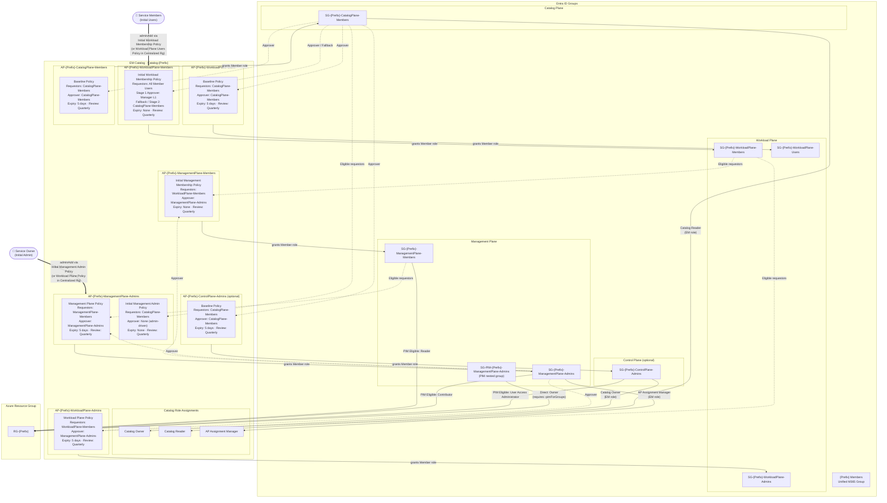
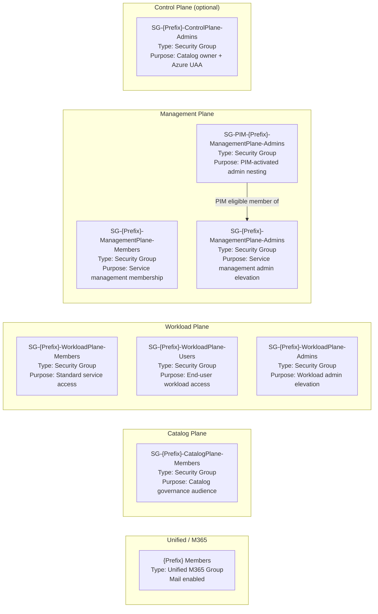
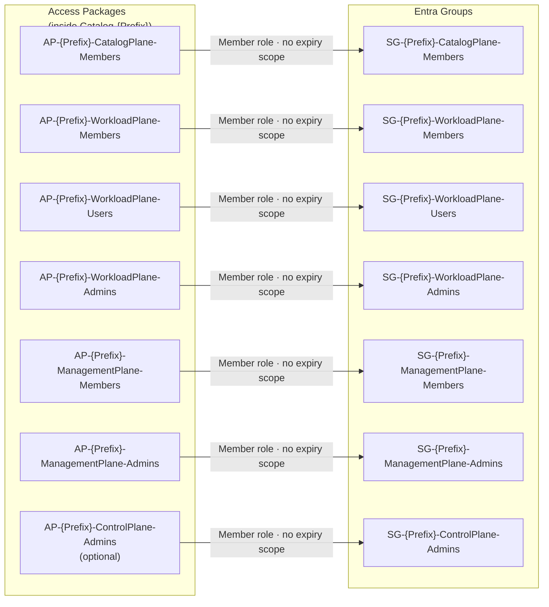
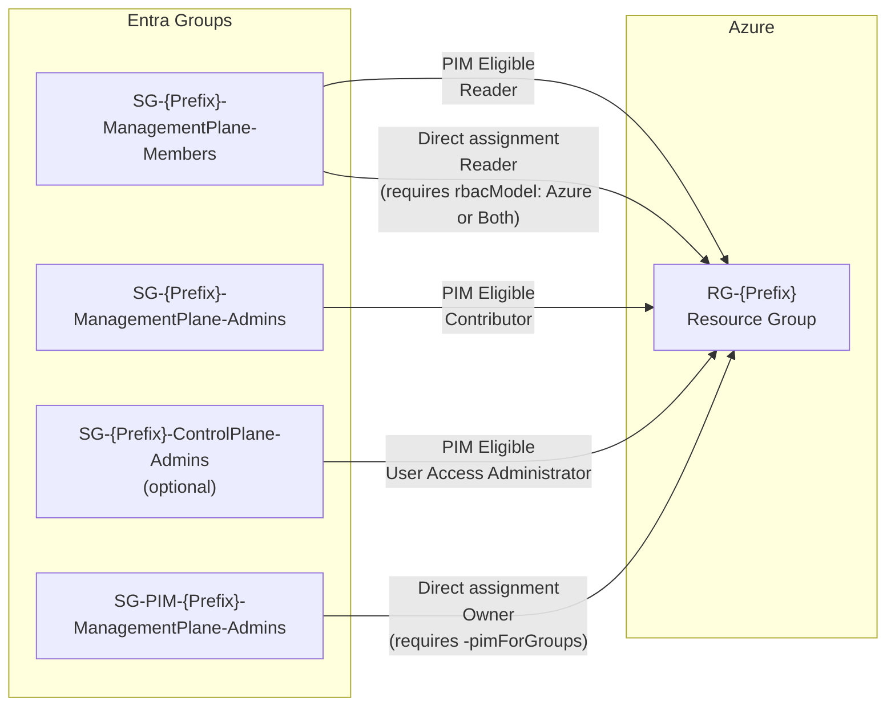
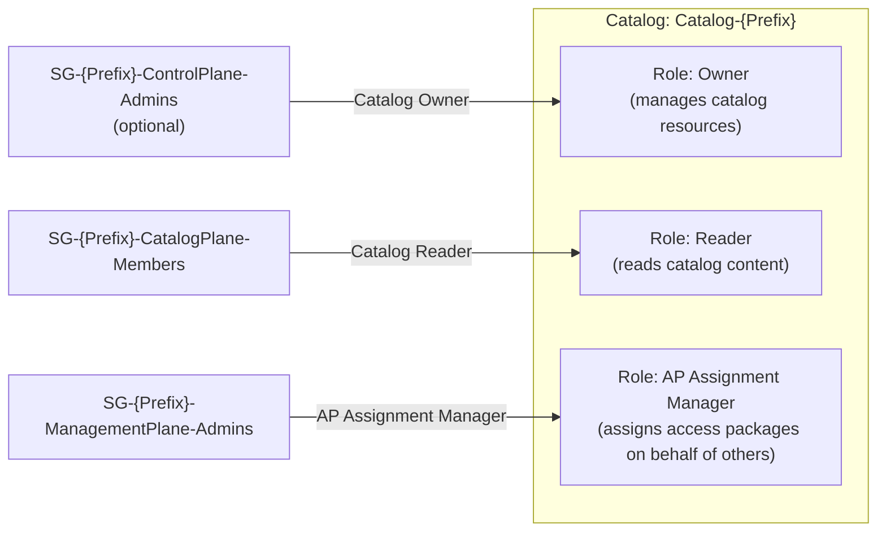
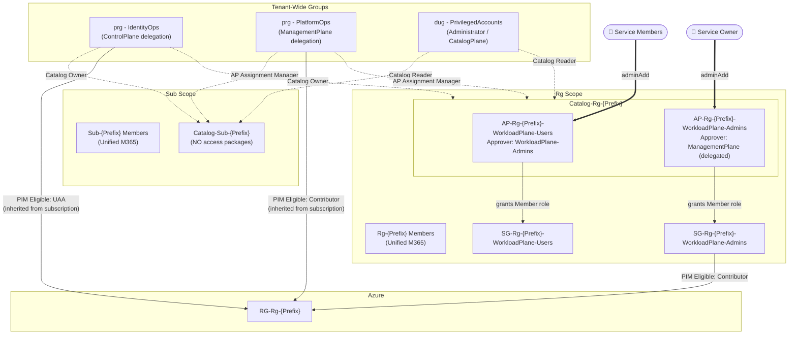

# ServiceEM Landing Zone - Resource & Dependency Visualization

> **Note**: This visualization represents a **PerService governance model** deployment where all groups are created per-service. For **Centralized governance** (using tenant-wide delegation groups), see the [Centralized Model Notes](#centralized-governance-model-notes) section below.

> Replace `{Prefix}` with your `-DeploymentPrefix` parameter value (e.g., `Sub-MyApp` or `Rg-MyApp`).  
> Nodes marked *(optional)* are skipped when using `-SkipControlPlaneDelegation`.  
> Nodes marked *(delegated)* are replaced by an existing group when a delegation Group ID is configured.

## Delegation Overview

ControlPlane-Admins and ManagementPlane-Admins groups can be **delegated** to existing groups instead of
creating new ones. This is useful when a central platform team already manages these groups across multiple
landing zones.

**How to configure delegation** (pick one):

| Method | ControlPlane-Admins | ManagementPlane-Admins |
|---|---|---|
| Parameter | `-ControlPlaneDelegationGroupId <ObjectId>` | `-ManagementPlaneDelegationGroupId <ObjectId>` |
| EntraOpsConfig | `ServiceEM.ControlPlaneDelegationGroupId` | `ServiceEM.ManagementPlaneDelegationGroupId` |
| Skip flag (no delegation, no creation) | `-SkipControlPlaneDelegation` | `-SkipManagementPlaneDelegation` |

When a delegation Group ID is set (via parameter **or** config), the skip flag is **automatically applied**:
no new group is created, and the provided group is used for all catalog role, policy approver, and Azure RBAC
assignments that would otherwise reference the landing-zone-owned group.

**What still uses the delegated group:**
- Catalog Owner role (`ControlPlaneDelegationGroupId`)
- AP Assignment Manager catalog role (`ManagementPlaneDelegationGroupId`)
- Access package approver in Workload Plane Policy, Management Plane Policy, Initial Management Membership Policy
- PIM-eligible Azure UAA on RG (`ControlPlaneDelegationGroupId`)
- PIM-eligible Azure Contributor on RG (`ManagementPlaneDelegationGroupId`)

**What is NOT applied to the delegated group:**
- PIM policy configuration (group is managed by its owning service)
- PIM eligibility assignments into the group

---

## 1. Full Dependency Overview

Shows all groups, the EM catalog with access packages, approver/requestor dependencies, and Azure RBAC in one picture.

---

## 2. Group Structure by EAM Plane

Which groups are created and how they map to the Enterprise Access Model planes.

---

## 3. Access Package → Group Resource Role Scopes

Each access package grants membership of exactly one group. Requesting and receiving approval for an AP automatically adds the user to the corresponding group.

---

## 4. Assignment Policies — Requestors, Approvers & Expiry

Who can request each access package and who approves it.

```mermaid
flowchart TD
    %% Groups referenced as requestor scopes or approvers
    AllUsers(["All Member Users\n(Tenant)"])
    Manager(["Requestor's Manager\n(L1 - Graph)"])
    G_CP["SG-{Prefix}-CatalogPlane-Members"]
    G_WP_Mbr["SG-{Prefix}-WorkloadPlane-Members"]
    G_MP_Mbr["SG-{Prefix}-ManagementPlane-Members"]
    G_MP_Adm["SG-{Prefix}-ManagementPlane-Admins"]

    %% ── AP-Members-WorkloadPlane ─────────────────────────────────────────────
    subgraph AP_WP_MBR["AP-{Prefix}-WorkloadPlane-Members"]
        POL_IWP["Initial Workload Membership Policy\nExpiry: None"]
    end
    AllUsers  -->|"can request"| POL_IWP
    Manager   -->|"Stage 1 Approver"| POL_IWP
    G_CP      -->|"Fallback + Stage 2 Approver"| POL_IWP

    %% ── AP-Members-ManagementPlane ───────────────────────────────────────────
    subgraph AP_MP_MBR["AP-{Prefix}-ManagementPlane-Members"]
        POL_IMP["Initial Management Membership Policy\nExpiry: None"]
    end
    G_WP_Mbr  -->|"can request"| POL_IMP
    G_MP_Adm  -->|"Approver"| POL_IMP

    %% ── AP-Admins-WorkloadPlane ──────────────────────────────────────────────
    subgraph AP_WP_ADM["AP-{Prefix}-WorkloadPlane-Admins"]
        POL_WP["Workload Plane Policy\nExpiry: 5 days"]
    end
    G_WP_Mbr  -->|"can request"| POL_WP
    G_MP_Adm  -->|"Approver"| POL_WP

    %% ── AP-Admins-ManagementPlane ────────────────────────────────────────────
    subgraph AP_MP_ADM["AP-{Prefix}-ManagementPlane-Admins"]
        POL_MP["Management Plane Policy\nExpiry: 5 days"]
        POL_IMA["Initial Management Admin Policy\nExpiry: None"]
    end
    G_MP_Mbr  -->|"can request"| POL_MP
    G_MP_Adm  -->|"Approver"| POL_MP
    G_CP      -->|"can request\n(admin-driven, no approval)"| POL_IMA

    %% ── Baseline Policy packages ─────────────────────────────────────────────
    subgraph AP_BASELINE["AP-Members-CatalogPlane  ·  AP-Users-WorkloadPlane  ·  AP-Admins-ControlPlane"]
        POL_BASE["Baseline Policy\nExpiry: 5 days"]
    end
    G_CP      -->|"can request"| POL_BASE
    G_CP      -->|"Approver"| POL_BASE

    %% ── Reviewer for all policies (dashed) ───────────────────────────────────
    G_CP -.->|"Access reviewer\n(Quarterly, 25-day window)"| POL_IWP
    G_CP -.->|"Access reviewer"| POL_IMP
    G_CP -.->|"Access reviewer"| POL_WP
    G_CP -.->|"Access reviewer"| POL_MP
    G_CP -.->|"Access reviewer"| POL_IMA
    G_CP -.->|"Access reviewer"| POL_BASE
```

---

## 5. Azure Resource Group RBAC

How groups are assigned to the Azure resource group created for the landing zone.

---

## 6. Catalog Role Assignments

Which groups hold governance roles in the EM Catalog itself.

---

## Summary Table

| Resource | Name | Depends on |
|---|---|---|
| Unified Group | `{Prefix} Members` | — |
| Security Group | `SG-{Prefix}-CatalogPlane-Members` | — |
| Security Group | `SG-{Prefix}-WorkloadPlane-Members` | — |
| Security Group | `SG-{Prefix}-WorkloadPlane-Users` | — |
| Security Group | `SG-{Prefix}-WorkloadPlane-Admins` | — |
| Security Group | `SG-{Prefix}-ManagementPlane-Members` | — |
| Security Group | `SG-{Prefix}-ManagementPlane-Admins` | *(delegated)* |
| Security Group | `SG-PIM-{Prefix}-ManagementPlane-Admins` | ManagementPlane-Admins (PIM nesting) — skipped when delegated |
| Security Group | `SG-{Prefix}-ControlPlane-Admins` | *(optional / delegated)* |
| EM Catalog | `Catalog-{Prefix}` | All groups above (registered as resources) |
| Catalog Role | Owner | ControlPlane-Admins as principal (own or delegated group) |
| Catalog Role | Reader | CatalogPlane-Members as principal |
| Catalog Role | ApAssignmentManager | ManagementPlane-Admins as principal (own or delegated group) |
| Access Package | `AP-{Prefix}-CatalogPlane-Members` | Catalog · CatalogPlane-Members group |
| Access Package | `AP-{Prefix}-WorkloadPlane-Members` | Catalog · WorkloadPlane-Members group |
| Access Package | `AP-{Prefix}-WorkloadPlane-Users` | Catalog · WorkloadPlane-Users group |
| Access Package | `AP-{Prefix}-WorkloadPlane-Admins` | Catalog · WorkloadPlane-Admins group |
| Access Package | `AP-{Prefix}-ManagementPlane-Members` | Catalog · ManagementPlane-Members group |
| Access Package | `AP-{Prefix}-ManagementPlane-Admins` | Catalog · ManagementPlane-Admins group |
| Access Package | `AP-{Prefix}-ControlPlane-Admins` | *(optional / delegated)* Catalog · ControlPlane-Admins group |
| Assignment Policy | Initial Workload Membership Policy | WorkloadPlane-Members AP · CatalogPlane-Members (approver) |
| Assignment Policy | Initial Management Membership Policy | ManagementPlane-Members AP · ManagementPlane-Admins (approver) |
| Assignment Policy | Workload Plane Policy | WorkloadPlane-Admins AP · ManagementPlane-Admins (approver) |
| Assignment Policy | Management Plane Policy | ManagementPlane-Admins AP · ManagementPlane-Admins (approver) |
| Assignment Policy | Initial Management Admin Policy | ManagementPlane-Admins AP · CatalogPlane-Members (requestors) |
| Assignment Policy | Baseline Policy | Three APs · CatalogPlane-Members (requestors & approver) |
| Initial Assignment | Service Members → WorkloadPlane-Members AP (PerService) or WorkloadPlane-Users AP (Centralized Rg) | Initial Workload Membership Policy or Workload Plane Users Policy |
| Initial Assignment | Service Owner → ManagementPlane-Admins AP (PerService) or WorkloadPlane-Admins AP (Centralized Rg) | Initial Management Admin Policy or Workload Plane Policy |
| Azure Resource Group | `RG-{Prefix}` | ManagementPlane-Members (Reader), ManagementPlane-Admins / delegated group (Contributor), ControlPlane-Admins / delegated group (UAA) |

---

## Centralized Governance Model Notes

When deploying with `-GovernanceModel "Centralized"` or when delegation group IDs are configured in `EntraOpsConfig.json`, the landing zone structure differs significantly:

### Key Differences

**Tenant-Wide Delegation Groups:**
- ControlPlane-Admins → Shared group (e.g., `prg - Contoso - IdentityOps`)
- ManagementPlane-Admins → Shared group (e.g., `prg - Contoso - PlatformOps`)
- AdministratorGroup (CatalogPlane-Members) → Shared group (e.g., `dug - PrivilegedAccounts`)

**Sub Scope Groups:**
| Group Created | Purpose |
|---|---|
| `Sub-{Prefix} Members` | Unified M365 group only |

**Sub Scope Access Packages:**
- **NONE** — No WorkloadPlane groups exist at subscription level → zero access packages created

**Rg Scope Groups:**
| Group Created | Purpose |
|---|---|
| `Rg-{Prefix} Members` | Unified M365 group |
| `SG-Rg-{Prefix}-WorkloadPlane-Users` | Security group for data-plane access |
| `SG-Rg-{Prefix}-WorkloadPlane-Admins` | Security group for workload admin elevation |

**Rg Scope Access Packages:**
| Access Package | Grants Membership To | Policy | Initial Assignment |
|---|---|---|---|
| `AP-Rg-{Prefix}-WorkloadPlane-Users` | `SG-Rg-{Prefix}-WorkloadPlane-Users` | Workload Plane Users Policy | Service Members |
| `AP-Rg-{Prefix}-WorkloadPlane-Admins` | `SG-Rg-{Prefix}-WorkloadPlane-Admins` | Workload Plane Policy | Service Owner |

**What's NOT Created (Centralized):**
- ❌ Per-service ControlPlane-Admins groups
- ❌ Per-service ManagementPlane-Admins groups
- ❌ Per-service ManagementPlane-Members groups
- ❌ Per-service CatalogPlane-Members groups
- ❌ WorkloadPlane-Members groups (neither Sub nor Rg scope)
- ❌ PIM staging groups for delegated groups

**What STILL Happens:**
- ✅ Tenant-wide delegation groups are added to each service's catalog as resources
- ✅ Catalog role assignments use the delegated groups (Owner, AP Assignment Manager)
- ✅ Azure RBAC assignments use the delegated groups (UAA, Contributor)
- ✅ Access package policies reference delegated groups as approvers

### Centralized Model Simplified Diagram

**Benefits of Centralized Model:**
- **Reduced group sprawl**: 3 tenant-wide groups instead of 5-7 per service
- **Consistent administrators**: Same IdentityOps team manages UAA across all services
- **Simplified PIM**: One activation for PlatformOps grants Contributor across multiple services
- **Clearer separation**: ControlPlane/ManagementPlane managed outside service landing zones

**When to Use Centralized:**
- ✅ 10+ services with dedicated operations teams (IdentityOps, PlatformOps)
- ✅ Organization has mature persona-based administration model
- ✅ Consistent delegation across all landing zones preferred

**When to Use PerService:**
- ✅ 1-5 services with dedicated service-specific teams
- ✅ Need full isolation between service administrative domains
- ✅ Dev/test environments where autonomy is prioritized
